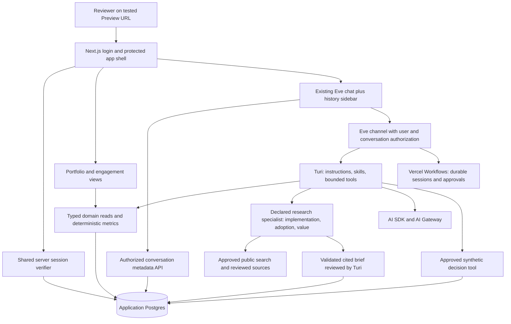

# Turas roadmap: interview demo and production evolution

Status: planning complete; implementation incomplete. The status tables below distinguish existing code, completed local fixes, unbuilt demo features, and deferred production work. No D0–D9 deliverable has met its full acceptance criteria yet.

Assessment date: 19 September 2026. Repository baseline: `2c7a076`. Interview date and available build time have not yet been supplied. Estimates are implementation ranges, not delivery commitments.

## Implementation status at IDE handoff

Start with [HANDOFF.md](HANDOFF.md) for the working branch, files, validation commands, and constraints. This snapshot is dated 19 September 2026. The changes are **uncommitted**, including new files; they are available in this working folder but will not appear in a fresh clone until committed/transferred. No new deployment was made.

| Capability | Status | Remaining boundary |
| --- | --- | --- |
| Next.js/Eve chat, streaming, cancel/steer, session URL resume, operating instructions and three skills | **EXISTING FOUNDATION** | Does not include login, a history index, structured business records, or business calculations. |
| Environment-based Basic auth, Vercel OIDC fallback, local-dev auth | **EXISTING FOUNDATION** | Not an employee SSO implementation or the planned login/session/ownership system. |
| Attachment cards, previews, add/remove files and links, file-only confirmed messages, next-draft preservation | **BUILT LOCALLY** | Four WebKit UI checks pass; hosted Preview validation/deployment pending. |
| Customer-first instructions, generic connector-discovery guard, non-interactive use of existing grants | **BUILT LOCALLY** | Notion regression and auth unit tests pass; full routing suite and hosted grants pending. Does not implement the D4 account resolver or source integrations. |
| Repeatable Playwright/WebKit setup, UI tests, auth unit tests, routing eval definitions | **BUILT LOCALLY** | Local results below; Node 24 and Preview release gates remain open. |
| D0–D9 demo scope, including D6R research | **PLANNED / STILL TO BUILD** | Detailed status and acceptance criteria in section 3. No complete interview workflow exists yet. |
| P1–P3 production evolution | **DEFERRED / NOT BUILT** | Separate post-demo scope in section 4. |

“Built locally” means code exists and the named checks passed; it does not mean deployed or production-ready. Keep `HINDSIGHT_BANK_ID=turas` and `agent/agent.ts` unchanged. Preview memory isolation is an unresolved design/configuration task, not permission to rename or override the existing bank.

### Local follow-up: attachment visibility, customer routing, and browser testing

These requested fixes are implemented locally on `fix/chat-attachments-customer-routing`; they have not been deployed or validated on a Vercel Preview:

- The composer now shows removable file and link cards, image previews, and an attachment count, with file-picker and link-dialog actions. Confirmed user messages render attachment cards; file-only messages do not create an empty text bubble. Draft clearing occurs on dispatch, so completing a response does not erase the next draft.
- Turi's instructions treat same-named organizations as customer engagements. Generic provider discovery is guarded until D4 supplies authorized customer-source resolution; missing connection grants do not initiate sign-in inside the conversation. This prevents the setup loop but does not supply missing engagement records. Existing user-scoped grant configuration is preserved.
- `npm run test:ui` runs four Playwright WebKit checks for attachment visibility/removal, narrow screens, link validation, send payloads, next-draft preservation, errors, and confirmed file-only messages. API interception keeps these browser checks independent of models and memory. The macOS launch configuration explicitly selects Playwright's bundled WebKit framework.
- Four connection-auth unit tests and the original Notion routing evaluation pass locally. The latter passed six gates, including no connector search and no authorization prompt. The complete routing evaluation set and hosted Preview checks remain outstanding. `HINDSIGHT_BANK_ID` remains `turas`.
- TypeScript and `npm run build -- --webpack` pass. The default Turbopack build is blocked locally when its CSS worker binds a port (`Operation not permitted`), including when run with elevated tool permissions. No build setting was changed; validate the default build in Preview. The WebKit suite also passes with its own automatically started development server.

The dedicated login, chat history sidebar, Vercel Preview setup, and research subagent remain scoped work below. Before deploying these fixes, validate authenticated access and existing-grant behavior in Preview as well as customer questions with missing records. Roll back the branch's application changes if those checks regress; no memory-bank migration is part of this change.

## 1. Product decision and scope

Turas is the FDE/PS customer-delivery command center; Turi is its assistant. Preserve that direction and the existing customer maturity, delivery methodology, and engagement health work.

The recommended interview demonstration is a **weekly FDE/PS operating review**: identify an engagement that needs intervention, inspect its evidence, compare the scope/staffing options and their economics, and record a human-approved decision. This connects the existing product to the Director's P&L accountability without requiring a complete professional-services automation system.

The central question is: **“Where should we intervene this week to protect the customer outcome and delivery margin without overcommitting the team?”**

The minimum complete experience is:

1. An interviewer opens a Vercel Preview link and signs in on a dedicated login page.
2. A clearly labeled synthetic portfolio shows delivery exceptions, forecast economics, and capacity.
3. The interviewer opens a fictional engagement and sees source evidence, maturity context, the delivery stage, and the pending decision.
4. Turi retrieves those records, explains a risk, and uses deterministic calculations to compare a bounded intervention. Where the path to implementation or adoption is uncertain, a research specialist supplies a cited implementation-and-value brief.
5. A person approves or rejects a proposed change to the synthetic demo records. The resulting state and audit entry are visible.
6. The interviewer can return to the conversation from a persistent chat history sidebar.
7. A one-page memo and an architecture explanation make the business and technical choices defensible.

All customer records, staff records, costs, contracts, outcomes, and evidence must be invented and labeled synthetic. The operating methods are proposals for the exercise, not claims about Vercel's internal practices. Reviewers must not need personal Linear, Notion, Coda, or other third-party accounts to complete the core demonstration.

### Planning decisions

| Decision | Proposed default | Reason |
| --- | --- | --- |
| Primary business workflow | Portfolio exception → engagement evidence → economic/capacity comparison → approved decision | Builds on the authored delivery model and makes P&L ownership visible. |
| Demo access | Environment-scoped owner/reviewer credentials behind an app login and server-verified cookie session | Gives reviewers an intentional entry flow without adding employee SSO to the interview critical path. |
| History | Application-owned conversation index in durable relational storage; Eve retains the conversation runtime | Supports user ownership, search, rename, archive, and return visits without creating a second agent runtime. |
| Application persistence | Postgres through a Vercel Marketplace integration; Neon is a proposed provider, subject to setup confirmation | Transactions and ownership queries fit conversation metadata, business records, and decision history. This is a new dependency, not an existing service. |
| Demo agent tools | Explicitly allowed domain reads/calculations and one approved synthetic write | Keeps the interview behavior grounded and repeatable. |
| Research specialist | One declared, read-only Eve subagent for implementation, adoption, and value realization | Separates source investigation from Turi's account interpretation, authoritative calculations, and decision authority. |
| External connectors | Optional demonstration using a dedicated synthetic workspace after the core flow passes | Existing definitions are not evidence of authorized or working integrations. |
| Model | Preserve `agent/agent.ts` | Changing the coding model for implementation does not authorize changing Turi's runtime model. |
| Preview deployments | Required before the interview | Explicit user requirement; use a stable branch preview plus a tested external share link. |

Do not infer a requirement to add a dashboard for every operating domain. Before the demo, ship one coherent operating review, the requested login, and the requested conversation history.

## 2. Baseline audit before the local fixes

This section records the initial assessment at `2c7a076`. In particular, its missing-tests, README, and unavailable-browser findings have been superseded by the implementation-status table and local validation above. Retain it as baseline evidence, not as the current completion checklist.

### What is present

| Area | Evidence | Assessment |
| --- | --- | --- |
| Next.js application | `app/page.tsx`, `app/s/page.tsx`, `app/s/[sessionId]/page.tsx`, `app/layout.tsx` | A chat-first web app. Root and session routes render the same chat component. Metadata names Turas Command Center. |
| Eve integration | `next.config.ts`, `package.json`, `vercel.json` | `withEve()` wraps Next.js; `build` runs `next build`; `build:eve` runs `eve build`. Vercel configuration has only its schema declaration. |
| Runtime/model | `agent/agent.ts` | Root model is `openai/gpt-5.6-luna-fast`. No authored budget/concurrency policy is visible here. Preserve the selection. |
| Chat interaction | `app/_components/agent-chat.tsx` | Streaming, stop/cancel, steering, first-session URL updates, resume from stream index zero, scroll restoration, and New chat already exist. |
| Chat rendering | `app/_components/agent-message.tsx` | Text/Markdown, tool inputs/results, reasoning, questions, approval controls, and connection-authorization prompts are rendered. This is useful infrastructure, not proof of an implemented business approval workflow. |
| Authentication | `agent/channels/eve.ts` | Environment-configured HTTP Basic auth, followed by Vercel OIDC and local development auth. No login page, cookie session, logout, or app-level user/account model. |
| Operating instructions | `agent/instructions.md` | Detailed evidence, source-of-truth, customer-first resolution, approval, capacity, delivery, and outcome policies. Strong product intent. |
| Operating skills | `agent/skills/customer-maturity-journey/`, `delivery-methodology/`, `engagement-health-and-risk/` | Six maturity stages and dimensions; delivery lifecycle and decision rights; evidence-based health/risk method. These expressly require structured records and deterministic rules elsewhere. |
| Agent capabilities | `agent/tools/*.ts`, `agent/extensions/browser.ts` | Eight authored tool files re-export Eve tools. Discovery also exposes built-in shell/file and browser capabilities. There are no authored customer-account, engagement, pricing, margin, or capacity tools. |
| External systems | `agent/connections/{coda,context,linear,notion,vercel}.ts` | Five MCP definitions use Vercel Connect. Granted scopes, remote authorization, data contents, and working execution are not verified. |
| Slack | `agent/channels/slack.ts` | Channel definition exists. A working installed Slack app and webhook delivery are not verified. |
| Memory | `agent/memory/file.ts`, `agent/hooks/hindsight.ts`, `agent/instructions/hindsight.ts` | Eve file memory is scoped by principal; Hindsight recall/retain uses environment configuration. Neither is an operational database or a conversation sidebar index. Hindsight's configured bank needs explicit environment/user isolation decisions. |
| Self-modification | `agent/subagents/self-modification/*` | A self-modification subagent and sandbox configuration exist; the config explicitly enables local behavior. Production exposure and effective permissions need review, not assumptions. |
| UI building blocks | `components/ui/`, `components/ai-elements/` | Existing inputs, buttons, dialogs, menus, command component, tool rendering, and conversation primitives can be reused. No authored history/sidebar application component. |
| Deployment | User reports the app running at `turas.dev`; `.vercel/project.json` exists | A linked project and reported live deployment. Hosted settings and end-to-end reviewer behavior remain unverified in this audit. |

### What is absent or not established

- No application database client, schemas, migrations, synthetic seeds, operational repositories, or business-domain services were found.
- No canonical account resolver. Prompt instructions address customer/provider ambiguity, but there is no deterministic resolver or regression suite implementing that policy.
- No portfolio view, account/engagement detail page, metric catalog, staffing model, financial model, scenario comparison, or durable decision log.
- No conversation listing, title persistence, search, rename, archive, or user-scoped history API. Existing URL resume requires knowing the session URL.
- No application enforcement of conversation ownership. Eve's documentation explicitly states that route authentication does not enforce per-session ownership.
- No authored evaluation files or application test suite were found. `npm run eval -- --list` reports no evals.
- No checked-in CI workflow, interview memo, demo script, architecture document, or environment-setup guide. `README.md` is still the Eve scaffold and does not describe the current Next.js web experience.
- No authored schedules. No business-specific durable action is implemented, although Eve supplies durable runtime infrastructure.
- No dedicated implementation/customer-success research subagent. Generic web tools and the root-copy delegation tool exist; neither supplies the bounded research process, output contract, or access restrictions scoped below.
- Instructions require approval, but the authored connector definitions do not establish an application-enforced approval policy for each external mutation. Do not treat prose or a visible approval component as enforcement.
- Reasoning is displayed by default; tool names and raw input/output are developer-oriented. These need deliberate presentation for GTM reviewers.

### Verification and limits

| Check | Result |
| --- | --- |
| `npm run typecheck` | Passed on the assessed repository. |
| `npm run eval -- --list` | Exit 2: no `*.eval.ts` files found. This is missing coverage, not a passing evaluation run. |
| `node node_modules/eve/bin/eve.js info --json` | Failed because this invocation did not receive the Hindsight API key. |
| `node --env-file=.env.local node_modules/eve/bin/eve.js info --json` | Passed: ready; zero discovery errors/warnings; three operating skills, 31 static tools, self-modification subagent, no schedules. No model turn or connector action was invoked. |
| Configuration inspection | Local environment variable names and Vercel-link keys inspected without displaying their secret values. Local `.env.local` has Gateway, memory, GitHub, Vercel OIDC, and Hindsight configuration names; it does not contain the demo login variable names. Shell and hosted environments can differ. |
| Live UI | Browser automation was unavailable; the web fetcher could not access `turas.dev`. This does not establish that the site is down. Screenshots, browser login, responsive behavior, and live chat were not verified. |
| Hosted environments | No Vercel settings, grants, credentials, or deployment state were changed or independently verified. |

The evidence supports “working assistant foundation with authored operating methods.” It does not yet support “working FDE/PS operating system with defensible commercial data.”

## 3. Before the demo

All items in this section are pre-demo work unless explicitly marked optional. P0 items are blockers; P1 items complete the review experience. The login page, history sidebar, and Preview configuration are required, even if other presentation scope is reduced.

**Completion status: implementation is complete for the interview slice; hosted end-to-end sign-in, persistence, and decision validation remain blocked on Preview-only credentials, a session secret, and the Turas database connection.** The current Preview build is ready, isolated from Production Hindsight memory, and protected by Vercel. The deployment does not yet receive `DATABASE_URL` or the demo login/session variables, so it cannot truthfully be marked as an end-to-end rehearsal.

### Delivery order and effort

Estimates assume one experienced implementer, existing accounts, small synthetic datasets, and no dependency upgrades. They include focused tests but exclude provider provisioning delays and broad production hardening. Ranges are not additive promises; auth/session integration is the largest uncertainty.

| ID | Deliverable | Implementation status | Priority | Depends on | Rough effort |
| --- | --- | --- | --- | --- | --- |
| D0 | Lock demo narrative, acceptance checklist, and runtime allowlist | **IMPLEMENTED** — synthetic scenario, demo guide, and narrowly discovered Eve tools; unused Slack channel removed | P0 | Audit | 0.5–1 day |
| D1 | Preview environment and isolated persistent storage | **PARTIALLY VERIFIED** — Preview is deployed and build-ready; Hindsight is isolated. Preview database and login/session configuration are still absent. | P0 | D0 | 0.5–1.5 days plus provisioning |
| D2 | Login page, session verification, and ownership foundation | **IMPLEMENTED / HOSTED VERIFICATION PENDING** — signed, revocable sessions and Next/Eve/page ownership checks are in code. | P0 | D1 | 1.5–3 days |
| D3 | Persistent chat history sidebar | **IMPLEMENTED / HOSTED VERIFICATION PENDING** — scoped list, search, rename, archive, and session-resume checks are in code. | P0 | D2 | 1.5–3 days |
| D4 | Synthetic operating model, account resolver, and evidence | **IMPLEMENTED** — fictional accounts, engagements, and canonical resolver are local fixtures. | P0 | D0, D1 | 1–2 days |
| D5 | Deterministic economics and capacity calculations | **IMPLEMENTED** — fixed-date contribution and capacity scenarios have unit coverage. | P0 | D4 | 1–2 days |
| D6 | Portfolio/engagement experience and grounded Turi workflow | **IMPLEMENTED / HOSTED VERIFICATION PENDING** — portfolio, engagement evidence, what-if controls, and bounded domain tools are in the branch. | P0 | D2, D4, D5 | 2–3 days |
| D6R | Implementation and value-realization research specialist | **IMPLEMENTED** — declared subagent uses a reviewed source pack. | P1 | D0, D2, D4; integrate with D6 | 1–2 days |
| D7 | One durable, approved synthetic decision | **IMPLEMENTED / HOSTED VERIFICATION PENDING** — owner-only intervention record supports approve, reject, and defer with a rationale. | P0 | D6 | 0.5–1.5 days |
| D8 | Memo, architecture explanation, demo script, reviewer handoff | **IMPLEMENTED** — in-app memo, architecture explanation, and `docs/DEMO.md` are present. | P1 | Draft after D0; finalize after D6R/D7 | 0.5–1 day |
| D9 | Preview regression checks, rehearsal, and submission | **PARTIALLY VERIFIED** — local type/unit/UI/build checks and hosted Preview build pass. The credentials/database-dependent rehearsal remains. | P0 | D1–D8, including D6R | 1–2 days |

A credible implementation is approximately 11–22 focused engineering days with some work overlapping; recalibrate after D2's integration check. If the deadline is shorter, reduce business breadth to one engagement and one intervention, simplify the portfolio to a compact table, bound research to one selected question, and defer connector demonstrations. Do not substitute ungrounded answers for data or remove login/ownership checks to save time.

### D0 — Freeze the interview slice and effective capabilities

**Deliverables**

- A scenario manifest with a fixed reporting date, explicit data version, three fictional customers, four engagements, and a small fictional team. Exact names/figures are implementation inputs, not discovered customer facts.
- Three paths: a normal operating review; a scope-overrun/capacity exception; and an unknown or ambiguous customer request.
- One decision: approve a bounded intervention to a synthetic engagement, or reject/defer it with rationale.
- A server-side demo capability profile. Keep the domain reads, deterministic calculators, clarification, the bounded research specialist, and the single approved synthetic write. Hide or disable unrestricted shell, browser, file-writing, self-modification, root-copy delegation, and broad external mutation capabilities in the reviewer environment unless a documented demo need justifies them. Declaring the specialist does not require retaining unrestricted root-copy delegation.
- Label the application and all business numbers “Synthetic interview demo.” Label operating methods as proposed, versioned models for the exercise.

**Done when:** the scenario can be described in one minute; each proposed capability serves it; the reviewer runtime cannot reach live customer data or silently mutate external systems. Test the effective discovered tool surface, including extension/default tools, rather than only removing files.

### D1 — Vercel Preview deployments and persistence

**Configuration plan**

1. Confirm the linked Git repository, production branch (`main` unless changed), root directory, Next.js preset, `npm run build`, default output directory, and Node `24.x`. Local audit ran under a different Node version earlier in this conversation; validate the build on the declared version.
2. Create a persistent `interview-preview` branch or PR containing the demo. Confirm its deployment is labeled **Preview**, not Production. Use branch deploys for the reviewed iteration; retain the immutable deployment URL/commit for the final submission record.
3. Add Preview-specific credentials and resource configuration. Existing variable names may have different values by environment. Environment changes require a new deployment. Branch-specific values can narrow the interview scope. [Vercel environment variables](https://vercel.com/docs/environment-variables)
4. Provision an isolated relational store or branch for the interview data and chat metadata. Use a dedicated synthetic seed/reset procedure; never populate it by copying live customer data. Vercel currently offers relational stores through Marketplace providers; do not describe the new store as an already-installed Vercel database. [Storage options](https://vercel.com/docs/storage)
5. Separate Preview and Production authentication/session secrets, data, memory backing resources, and connector authorizations. Apply least privilege rather than copying the complete local environment. Preserve the user's existing `HINDSIGHT_BANK_ID=turas`; agree the Preview memory isolation approach before configuring a separate resource. Do not rename or override the current bank for testing.
6. For protected previews, generate an external shareable link from the deployment's Share control. This passes Vercel's access check; the application login still authenticates the reviewer. Test that the share-link query string survives the redirect to login. [Shareable links](https://vercel.com/docs/deployment-protection/methods-to-bypass-deployment-protection/sharable-links)
7. Test first message, stream reconnect, approval response, and any retained OAuth/Workflow callback on the actual Preview. Callback authentication is a separate boundary: preserve Eve's signed callback validation and avoid a blanket deployment-protection exception.

**Environment contract to document**

| Configuration | Preview requirement |
| --- | --- |
| `TURAS_DEMO_USERNAME`, `TURAS_DEMO_PASSWORD` | Separate reviewer credentials; server only. Preserve names for the initial login migration, with password handling contained on the server. |
| `TURAS_SESSION_SECRET` (new) | Unique to Preview; signs/verifies application sessions. Never expose through `NEXT_PUBLIC_*`. |
| `DATABASE_URL` (new) | Dedicated interview database/branch. Explicit migration and reset target. |
| `TURAS_DEMO_MODE` (new) | Server-side capability/data profile, not a client-only UI flag or authentication bypass. |
| Gateway access | Confirm the project's supported OIDC/Gateway credential path in the hosted environment; do not assume a local development key is necessary. |
| Hindsight variables | Preview isolation and reset behavior remain to be designed. Preserve the existing `HINDSIGHT_BANK_ID=turas`; no bank change is authorized by this plan. |
| File memory / Blob | Confirm how `fileMemory()` persists in the deployed backend and isolate its configured backing resources. Existing local variable names alone do not prove hosted setup. |
| Connect / Slack | Only if included in a named demo path; authorize a synthetic workspace in Preview and test its callback. Otherwise omit from reviewer capabilities. |
| Research source access | Verify the chosen search/fetch tools work in Preview and document any server-only provider configuration. A reviewed source pack supports reproducibility and an explicitly labeled fallback. |

**Done when:** a person outside the Vercel team can open the exact shareable link in a fresh browser, reach `/login`, authenticate, use chat and the business scenario, and reopen history. Production credentials cannot authenticate to Preview and vice versa. Save the tested commit, URL, and time in the release checklist. Resource setup and deployment remain explicit build-phase actions; nothing is configured by this roadmap.

### D2 — Dedicated login page and server-side session authorization

**User experience**

- `/login` has Turas branding, a short synthetic-demo explanation, labeled username/password fields, accessible errors, pending state, password-manager-compatible autocomplete, and a clear Sign in button.
- Unauthenticated visits to `/`, `/s`, `/s/:sessionId`, the portfolio, and engagement pages redirect to `/login` before fetching/displaying protected content. Preserve a validated same-origin return path.
- Successful login establishes an application session and returns the user to that path or the portfolio. No native Basic-auth prompt and no need to visit `/eve/v1/info`.
- Add a signed-in identity menu and logout to the shared app shell. Expiration returns the user to login while preserving a safe return URL and an unsent draft when practical. Do not silently replay a message or approval after login.
- Distinguish invalid credentials, rate limiting, and service unavailability without exposing account/secret details. Loading, keyboard focus, Enter submission, and screen-reader feedback are part of the feature.

**Authentication design**

- Keep the demo's limited environment-scoped identities. This is not public registration: no sign-up, password-reset email, organization management, or employee directory before the demo.
- Prefer a supported session/auth library. Concrete demo default: the documented Next.js cookie-session pattern using an explicitly installed `jose` dependency, server-only credential validation, and a database session/revocation record. Do not implement cryptographic primitives or rely on Eve's transitive dependencies. Reuse Eve's credential verifier where appropriate. [Next.js authentication guidance](https://nextjs.org/docs/app/guides/authentication)
- Store only minimal identity/session claims in the cookie: stable user subject, session ID, environment/issuer/audience, issued time, and expiry. Never put the password in the cookie or browser storage. Proposed initial lifetime: eight hours; database session state makes logout/revocation effective before expiry.
- Hosted cookie: `HttpOnly`, `Secure`, `SameSite=Lax`, `Path=/`, host-only. Use a distinct local-development configuration. Validate allowed origins/CSRF on state-changing requests; validate return URLs; rate-limit login attempts using durable state or an appropriate platform control.
- Share a server-side verifier between Next.js and Eve. Its core accepts a standard `Request`/headers and does not depend on `next/headers`; Next-specific adapters can wrap it. Eve is built as its own service, so importing Next-only runtime code into its channel is not a valid assumption.
- Replace browser Basic authentication with this verifier in `agent/channels/eve.ts`. Preserve the narrowly justified Vercel infrastructure path and local development behavior; neither may become a fallback that admits an unauthenticated hosted browser.
- The verifier returns a stable `principalType: "user"` identity. Document its relation to existing Basic-auth principal IDs so old memory/connection grants are not accidentally transferred or lost. Prefer a clean synthetic reviewer identity; do not migrate grants implicitly.
- Protect the real Eve endpoints in addition to pages and Next APIs. A Next layout or `proxy.ts` redirect alone cannot be assumed to cover routes mounted to the separate Eve service. Public health and signed framework callbacks need their own documented policy.

**Conversation authorization and creation**

- Every conversation read, stream, follow-up, approval response, cancellation, compact, clear, reset, rename, and archive must verify owner/workspace/environment on the server. Check child-session streams through their owned parent too. An authenticated user with another person's session URL must not gain access.
- Introduce an application conversation record before first-send dispatch. A server-side creation adapter invokes the supported Eve client/channel API under the verified user identity and binds the resulting Eve session ID before exposing it as usable history. Use a stable operation ID and a pending/active/failed state to recover when Eve accepts a message but a database write or browser connection fails.
- Never provide a client endpoint that can claim an arbitrary existing Eve session ID. `onSessionChange` may refresh UI state; it is not ownership evidence.
- Keep Eve's durable session and streaming protocol. A small first-send adapter is permitted; replacing its conversation runtime is out of scope. If a transport adapter is needed for the current Eve release, preserve user identity and enforce ownership on direct Eve routes as well.
- **First implementation gate:** prove cookie verification across Next/Eve, authenticated creation/binding, and rejection of a second user's stream/follow-up before building the polished login/sidebar. Verify the exact supported client/channel calls against the installed docs/types. If integration requires more work, report it before widening scope.

**Candidate files**

`app/login/page.tsx`, `app/login/login-form.tsx`, `app/api/auth/{login,logout,session}/route.ts`, `lib/auth/{credentials,session,authorize}.ts`, Next-only auth adapters, `lib/db/*`, `agent/channels/eve.ts`, and a protected layout/route group. Optional `proxy.ts` is navigation assistance, not the only security boundary. These paths are proposed, not existing imports.

**Acceptance criteria**

1. A fresh reviewer sees the login page before chat; valid login, refresh, deep link, expiration, and logout work.
2. Missing/incorrect credentials, tampered/expired cookies, cross-environment cookies, revoked sessions, and unsafe return URLs fail safely.
3. The first chat has no authentication prompt or setup error; cookies authenticate follow-up and reconnect requests.
4. A second test user cannot list, open, stream, alter, approve, or cancel the first user's conversation through either UI or direct API requests.
5. No password/token appears in rendered HTML, client bundles, localStorage, logs, or URLs. No native Basic challenge remains in the browser path.
6. Existing allowed runtime callbacks and local development behavior still work; unauthorized direct Eve calls remain rejected.

### D3 — Chat history sidebar

**Interaction scope**

- A persistent left sidebar on desktop with Turas branding, New chat, a conversation search field, recent conversations, the active conversation, and the signed-in account/logout control. Include navigation to the portfolio and memo without duplicating the chat runtime.
- Collapse/expand on desktop; a keyboard-accessible drawer with focus trapping, Escape-to-close, and focus return on small screens. Use existing dialog/menu primitives.
- Recent history ordered by latest message activity, grouped into Today, Yesterday, Previous 7 days, and Older in the viewer's timezone. Rename must not make an old chat appear newly active.
- Each row has a readable title, active styling, optional in-progress indicator, and menu actions **Rename** and **Archive**. An Archived view can restore a conversation. Archive is reversible metadata; it does not delete Eve history, revoke access, or cancel a running turn.
- First accepted user message supplies a deterministic, length-limited title. The user can rename it. AI-generated titles, folders/projects, pinning, full-transcript search, and permanent deletion are post-demo improvements.
- Search titles on the server; paginate at 30 results with a stable `(lastMessageAt, id)` cursor. Search is scoped before results are returned. Treat the query as data, not executable SQL/regex.
- New chat opens an empty composer and does not erase the previous session. No conversation record is created simply by browsing the empty page; create its pending record on first send.
- Sidebar data survives reload and later sign-in as the same user. Define whether reviewer credentials are shared: one shared account intentionally has shared history. If individual reviewers require private history, issue separate identities; do not promise isolation within one username.

**Data contract**

Use a `conversations` record with `id`, `environmentId`, `workspaceId`, `ownerUserId`, unique nullable `eveSessionId`, `title`, `createdAt`, `lastMessageAt`, `archivedAt`, `creationOperationId`, `creationState`, and a concurrency/version field. Owner/environment fields come from verified server identity, not the request body.

| Proposed API | Behavior |
| --- | --- |
| `GET /api/conversations?q=&cursor=&archived=` | List/search only authorized conversation metadata. |
| `POST /api/conversations` | Validate first message and operation ID, create/bind a conversation under D2, and return the authoritative ID/session mapping. |
| `PATCH /api/conversations/:id` | Validate a bounded title or archive/restore action; authorize and apply optimistic concurrency. |
| Existing Eve session/stream/control endpoints | Reuse for live conversation behavior, with D2 ownership enforcement. Do not invent a `GET /eve/v1/sessions` listing endpoint. |

**Persistence and streaming behavior**

- Keep transcript execution/replay in Eve for the demo. Store history metadata in Postgres; do not claim that localStorage, Hindsight, or the sandbox filesystem is durable application history.
- Update metadata from trusted server lifecycle events/adapters, including completion when the browser is closed. Updates are idempotent, tolerate replay, and do not overwrite user-edited titles. Use persisted event IDs for event deduplication and the relevant turn/operation identity for effects that must occur once; these are different guarantees.
- Reuse `initialSession`, `resume`, and existing URL routes. The hook reads session configuration when its store is created: key/remount the chat binding by the selected conversation. Test that switching A → B never sends to A or displays A's stream in B.
- Preserve the current first-message URL behavior deliberately. If D2's server creation adapter changes it, do not send the first message twice or lose the stream during the route transition.
- Replace the viewport-centered fixed composer/header positioning in `agent-chat.tsx` with a layout relative to the remaining chat pane; otherwise a new sidebar will overlap/misalign them.
- Navigating away detaches the view but does not silently cancel a durable run. Reopening resumes/catches up. Stop remains an explicit user action.
- Provide skeleton/loading, no-history, no-search-results, failed-list retry, unavailable/expired-session, forbidden/not-found, and offline/reconnecting states. Disable send/approval during hydration as the existing component does.
- Explain the retention boundary. Verify Eve/Workflow transcript availability over the interview window before claiming indefinite history. If the runtime cannot meet the required window, promote authorized transcript projection to pre-demo work; do not ship permanent links to unavailable content.

**Candidate files**

`app/_components/app-shell.tsx`, `chat-sidebar.tsx`, `conversation-list.tsx`, conversation menu/search components, `app/api/conversations/*`, `lib/conversations/*`, database migration, and an Eve channel event handler/hook if appropriate. Modify `agent-chat.tsx` and the session pages; preserve existing rendering and approval components.

**Acceptance criteria**

1. Create two conversations, reload, reopen each, rename one, search it, archive and restore it; contents and IDs remain correct.
2. Repeated/retried creation and lifecycle events do not create duplicate history rows or duplicate first messages.
3. Switch conversations during a response, reopen the first, and resume the correct durable stream; approval controls target the correct session.
4. Close the tab during a turn and reopen later; the conversation remains discoverable and has correct activity metadata.
5. A second principal and a second environment cannot discover or operate the first principal's conversations.
6. Keyboard-only and narrow-screen users can open, navigate, and dismiss the sidebar; focus, scroll position, composer width, and selected state remain usable.

### D4 — Synthetic records, evidence, and deterministic account resolution

**Small domain model**

| Record | Minimum information |
| --- | --- |
| Customer account | Canonical ID, fictional name/aliases, objective, synthetic marker, authorized workspace. |
| Engagement | Account ID, proposed service offering, scope/exclusions, contract model/value, dates, lifecycle stage, delivery/customer owners, next decision. |
| Outcome/evidence | Baseline, target, measure/unit, source record, observed/as-of time, freshness limit, confidence/known gaps. |
| Maturity profile | Assessment boundary, method version, dimension states, supporting evidence, next milestone. No invented overall score. |
| Risk/dependency | Condition, classification, customer consequence, state, owner, deadline, closure evidence. |
| Capacity/allocation | Fictional person/role, skill constraints, weekly available hours, leave/protected time, existing commitments, proposed demand. |
| Commercial assumptions | Currency, fee/rate, effort forecast, actual effort where simulated, loaded costs, non-labor expense, reporting period, metric version. |
| Decision | Proposal, before/after, evidence/assumption versions, approver, approval/rejection, timestamp, idempotency key, execution outcome. |

Version the fixtures and load them through a maintained repository/service interface with Zod validation. A declared synthetic dataset is an approved source for this exercise; it must never masquerade as discovered production CRM data. Add a guarded, environment-scoped reset script and an observable seed version. Resetting demo business data must not delete application auth/history without an explicit separate operation.

Implement typed reads such as `resolve_customer_account`, `get_engagement_brief`, `get_portfolio_summary`, and `get_capacity`. The resolver returns a canonical account ID, an explicit not-found state, or bounded candidates. Downstream tools accept IDs, not raw customer names. Include a synthetic alias/provider-name collision fixture and confirm that customer intent does not trigger connector setup.

**Done when:** all demonstrated facts link to seed records/evidence; missing and ambiguous cases are handled; UI and Turi read the same records; unauthorized scope is filtered before model context is created.

### D5 — Economics, capacity, and the commercial decision

Add a small versioned metric module shared by UI and tools. Perform arithmetic in code, with defined rounding and null/error behavior; the model explains results rather than calculating the authoritative numbers.

| Metric | Required definition |
| --- | --- |
| Engagement fee forecast | Fixed fee uses the contracted synthetic fee plus only approved change orders; T&M uses forecast billable hours × realized rate. Keep booking value, forecast revenue, actual recognized revenue, and cash separate. |
| Effort at completion | Actual hours to date + estimated remaining hours; show forecast revision and assumptions. |
| Engagement delivery cost | Role/person effort × explicit loaded hourly cost + direct non-labor expense. Label it allocated delivery cost. |
| Engagement contribution | Fee forecast − engagement delivery cost; divide by fee for contribution percentage when fee > 0. Do not call this the entire function's profit. |
| Function gross profit | Period revenue forecast − all delivery-team payroll/benefits for the period − direct external delivery costs. Include bench/non-billable cost; avoid counting allocated labor again. |
| Operating contribution | Function gross profit − separately defined services operating overhead. Label this a planning view, not an audited financial statement. |
| Billable utilization | Billable delivery hours ÷ working hours available after leave/holidays. Protected enablement/presales time remains visible in the denominator and capacity plan. |
| Remaining schedulable capacity | Available hours − committed delivery − protected internal work. Show by week and required skill; aggregated free hours cannot resolve a specialist conflict. |
| Pricing floor | Explicit cost / (1 − target margin) for a fee; for T&M derive rate using forecast billable hours. Reject invalid margin targets and zero denominators. |

**Illustrative calculation to use as a regression anchor, not a Vercel benchmark:** a fictional fixed-fee engagement has a $60,000 fee, 240 hours at $125 loaded cost/hour, and $3,000 other delivery cost. Cost is $33,000 and contribution is $27,000 (45%). Another 80 hours raises cost to $43,000 and lowers contribution to $17,000 (28.33%). Reducing that overrun to 40 hours gives $38,000 cost and $22,000 contribution (36.67%). The intervention protects $5,000 of forecast engagement contribution versus the full overrun; it is not realized savings until evidence confirms it.

The scenario must also show where those 40 or 80 hours come from, which other commitment competes for them, what customer scope/outcome changes, and who must approve. A reallocation of salaried staff does not automatically reduce period payroll expense.

Include a compact offering/qualification assumption: what is paid PS delivery, what is funded strategic FDE investment, who can approve an exception, and what triggers a change request. Keep one selected service motion in the demo; a complete catalog and contracting engine are post-demo.

**Done when:** portfolio and engagement totals reconcile to their inputs; sensitivity to effort/rate/availability is visible; zero/stale/missing inputs produce explicit unknown/invalid states; deterministic tests cover arithmetic, double counting, date overlaps, leave, and over-allocation. State all sample costs and targets as assumptions.

### D6 — A visible command center and grounded agent workflow

- Add a compact `/portfolio` view: reporting period, synthetic-data badge, forecast revenue/contribution, capacity pressure, and an exception table. Every number has a definition, as-of time, and drill-down.
- Add one reusable `/engagements/:id` detail view: customer outcome, maturity profile, lifecycle/next gate, evidence, risk, commercial baseline, proposed intervention, owner, and decision deadline.
- Keep maturity, engagement health, and commercial economics distinct. Do not synthesize a single opaque score. Use existing skill terminology, including Unknown when evidence is insufficient.
- Add bounded what-if controls for remaining effort, start date/skill allocation, and an explicitly hypothetical fee adjustment. Changes preview results and are not persisted until approved.
- Add “Ask Turi about this engagement” with canonical context. The server validates that context; a browser-supplied account ID never grants access.
- Expose grounded typed tools using D4/D5. Require evidence references, timestamps, assumptions, and metric versions in outputs. Drafts and hypotheses are visually distinct from facts and approved decisions.
- Add a few scenario starter prompts, including the exception and missing-data paths. Replace empty “Turi” alone with orientation that explains the decision the app supports.
- Present concise tool progress and expandable evidence; collapse optional technical details. Do not use raw reasoning as the business rationale. Keep an explicit explanation of evidence/assumptions available.

**Done when:** the panel can independently discover the core workflow; the same inputs yield identical metrics in UI/tool output; Turi names the customer consequence and a decision owner; arbitrary unsupported customer questions produce a clear limitation instead of plausible facts or connector prompts.

### D6R — Research across implementation, adoption, and value realization

**Purpose and placement**

Add a declared local subagent, provisionally `implementation-research`, that investigates how a proposed technical solution can be implemented, adopted, operated, and measured. Its job is to inform a delivery decision with external evidence and reusable patterns. It does not decide what is true about a customer, calculate authoritative financial results, or approve changes.

Invoke it when an engagement has an unresolved implementation choice, rollout risk, adoption blocker, or unclear path from launch to the intended business outcome. Do not invoke it for ordinary record retrieval or arithmetic. A suitable demo question is: “For this fictional customer's pilot, which rollout and customer-enablement patterns reduce adoption risk, who needs to own them, and what evidence would tell us within 30 days whether value is being realized?”

The pre-demo slice is **one on-demand, bounded research brief tied to the selected engagement**. Recurring research, a broad pattern library, and cross-customer outcome learning belong after the demo. Research should demonstrate both engineering and customer-success judgment within the same brief.

**Research coverage and output**

| Dimension | Required questions and outputs |
| --- | --- |
| Technical fit | Relevant architecture/integration options; prerequisites; identity/data constraints; evaluation and reliability requirements; alternatives rejected and why. Cite current primary technical documentation. |
| Implementation pattern | Discovery/readiness checks, phased pilot vs wider rollout, dependencies, validation/acceptance gates, rollback conditions, and who owns delivery and ongoing operation. |
| Customer success and adoption | Stakeholder/sponsor alignment, user workflow fit, champion or train-the-trainer options, communications, enablement, support, feedback cadence, and an explicit handoff to the customer's operating owner. |
| Value realization | Intended outcome, proposed baseline/target and measurement method, time-to-first-value, leading adoption signals vs lagging business outcomes, review cadence, and criteria to continue, adapt, or stop. Unknown baselines stay unknown. |
| Applicability | Why each pattern fits this engagement's maturity, constraints, and delivery stage; limitations, prerequisite gaps, counterevidence, and open questions. A pattern reported by another organization is not proof it will work here. |
| Commercial implications | Potential effort, scope, support, and capacity implications as assumptions to test. Turi routes numeric scenarios through D5; the child cannot promise margin, savings, customer ROI, or expansion revenue. |

Define a validated `ResearchBrief` contract with a schema/version, question, as-of time, recommendation summary, alternatives, patterns, prerequisite/owner checklist, phased implementation/adoption plan, proposed success measures, risks/gaps, and a source list. Claims reference source IDs. Each source records its URL, title/publisher, retrieval date, publication/update date when available, source type, and the specific claim it supports. Each recommendation states whether it is directly supported, inferred for this engagement, or an assumption requiring validation.

Store the validated brief and its source references with the authorized conversation, canonical account/engagement IDs, environment/workspace/owner scope, and input record versions. Expose it as an engagement/chat artifact that can be reopened from history. Persist through a trusted parent-side service after validation; give the research child no arbitrary application writes. Use a stable research-request ID to deduplicate completion/retry persistence. Research results are proposals and external evidence, never newly observed customer outcomes.

**Source and capability boundaries**

- Use primary technical documentation for capability/configuration claims. For implementation/adoption patterns, prefer public operational guides and attributable case studies; identify vendor-authored or self-reported results and their limitations. Do not present a case study as causal proof or an industry benchmark.
- Provide a small reviewed source pack for the selected scenario and allow bounded public search/fetch for follow-up questions. Record whether the brief used live retrieval or a dated prepared pack. A cached brief or source snapshot must never be presented as fresh live research.
- Treat fetched content as untrusted evidence. Ignore instructions embedded in it; do not transmit credentials, private records, or a full conversation to external search. Derive de-identified queries from the approved research question.
- Implement the child under `agent/subagents/implementation-research/` with its own `agent.ts`, instructions, and explicitly allowed read-only source tools. Use an explicit model choice consistent with the existing root selection; do not change `agent/agent.ts`. Read the installed subagent docs and inspect effective defaults when implementing.
- A declared Eve subagent does **not** inherit the root's authored instructions, skills, tools, connections, or hooks. Supply the minimal maturity/delivery/value methodology it needs, or mount a shared skill deliberately. Framework defaults may still exist: explicitly disable unnecessary shell, file-write, generic browser automation, and other default capabilities, then verify the compiled surface. Do not give this specialist self-modification, external mutation, or nested delegation.
- Pass a narrow, server-authorized context packet: research question, intended decision, canonical IDs, relevant verified facts/evidence, maturity/delivery stage, constraints, and unknowns. Eve's actual delegation input is `message`, optional `agentId`, and optional `outputSchema`; the child does not see parent history. Require structured output and validate it again before persistence/use.
- Bound sources, queries, runtime, concurrency, and total parent-plus-child spend. Start with one active research task per conversation, up to six searches/eight reviewed sources, and a two-minute target; calibrate after rehearsal. Enforce hard limits through supported runtime controls or tool wrappers, not prompt text alone, and document any partial-result limitation. These are proposed budgets, not claims that specific Eve configuration flags already exist.

**User experience and orchestration**

Offer “Research implementation and adoption” from the engagement context and permit Turi to recommend it for a clear evidence gap. Show the question, working/completed/partial/failed state, sources, and a concise brief with expandable detail. Preserve the research reference when navigating between chats. Show preparation/retrieval dates so the panel can distinguish the prepared evidence from a live investigation.

Eve runs declared specialists as durable background tasks. Wire progress and explicit cancellation to the actual task handle; stopping the initiating chat turn or leaving the page does not necessarily cancel admitted child work. Apply D2 ownership checks to child streams and task operations. Avoid claiming that an unrelated parent turn completion means research is complete.

Turi reviews the brief against D4 account evidence, calls D5 for any commercial comparison, and proposes an intervention through D7 only when warranted. A customer training plan, handoff checklist, or 30-day measurement plan can be a useful result even when the technical architecture needs no change. External recommendations must not silently modify engagement facts, staffing, or commitments.

**Acceptance criteria**

- The selected demo question returns cited technical recommendations **and** an applicable rollout/adoption/handoff/measurement plan with owners or explicit ownership gaps.
- Missing, conflicting, stale, or inaccessible evidence is disclosed; fabricated citations and invented customer baselines fail the evaluation. Claim-to-source support and engagement fit are checked, not just the presence of links.
- A technical-only answer fails when the question requires adoption/value work. A generic success checklist without engagement-specific applicability also fails.
- Timeout, cancellation, provider failure, retry, and prepared-source fallback produce truthful status and no duplicate stored brief or unauthorized mutation.
- Negative tests cover cross-user parent/child access, source prompt injection, query data leakage, and attempts to acquire write tools. No change is executed without D7's approval/authorization boundary.
- One held-out question and the selected scenario pass a small research evaluation rubric: evidence quality, applicability, implementation feasibility, adoption ownership, measurement clarity, and uncertainty handling.

### D7 — One approved, durable synthetic action

Implement a bounded action such as `record_engagement_intervention` that updates the synthetic engagement plan and decision log. It must show the proposed scope/effort/capacity change, economic delta, evidence, target records, and expected version before approval.

- Use Eve's actual tool approval mechanism and authorization for the responder, not an instruction asking the model to remember to ask.
- Retain the durable approval across refresh/navigation, then apply the approved change transactionally with a stable idempotency key and expected record version.
- Recheck the actor and current data at execution. If the inputs changed after proposal, show a conflict and require a new decision instead of executing the stale plan.
- Rejection produces no business mutation. Success returns a persisted decision ID; failure reports whether anything changed and provides a safe retry path.
- Show a Workflow run/trace for the scenario and demonstrate refresh/reconnect while waiting. Do not create a second workflow framework merely to count another product.
- Keep real task creation, staff assignment, customer communications, and platform/deployment modifications outside the mandatory demo.

**Done when:** approve/reject, refresh while waiting, duplicate submit, stale version, invalid approver, and retry-after-timeout tests pass; the UI reads back the durable decision and reconciled updated values. Eve's durable execution does not remove the need for application idempotency.

### D8 — Memo, architecture, and interview materials

Create the required one-page memo in `/memo` or an accompanying printable page, and link it from the app. It must answer:

1. Why a weekly operating review is a first-90-days priority and which decision it improves.
2. How scope control, staffing fit, and timely decisions affect services revenue, cost, utilization, capacity, and customer outcomes.
3. Which figures are assumptions and which would be pressure-tested in the first 30 days: offering demand/willingness to pay, loaded cost, actual effort and rework, utilization denominator/target, skills bottlenecks, scope-change frequency, customer ownership, and strategic-FDE funding.
4. What comes next and the evidence required to justify it.

Update the README with the product purpose, Node/package-manager requirements, Next.js development commands, environment names, data seed/reset instructions, verification commands, demo navigation, and known limitations. Add a concise architecture diagram and a 20–25-minute script, plus questions for the panel about the operating/commercial model.

**Vercel capability evidence plan**

| Capability | Deliberate purpose | Existing evidence / demo proof required |
| --- | --- | --- |
| AI SDK through Eve | Model/tool execution and structured conversational interaction | `ai` dependency and Eve UI integration exist. Show a grounded typed-tool call and its result; explain that Eve owns orchestration. |
| AI Gateway | Managed model access and usage/cost visibility | String model configuration and local credential name exist. Verify a hosted scenario call and its Gateway usage record; do not count mere installation. [AI Gateway](https://vercel.com/docs/ai-gateway) |
| Vercel Workflows through Eve | Durable agent progress, waiting for approval, and resumption | Eve integration provides the runtime path. Show an actual hosted run and a refresh-safe approval/resume. [Workflows](https://vercel.com/docs/workflows) |
| Preview Deployments + Deployment Protection | Review the exact change safely and share with the panel | Configure/test under D1; use as additional capability evidence rather than the only interpretation of “beyond deployment.” |
| Vercel Connect | Delegated access to an external system | Five authored connections exist; optional synthetic-workspace proof only. Do not claim a working integration until tested. [Connect](https://vercel.com/docs/connect) |
| Sandbox / Blob | Isolated execution or file/memory storage if the chosen workflow needs it | Configuration/extensions suggest potential use, not verified interview value. Count only demonstrated, necessary behavior. |

The conservative core is AI SDK, AI Gateway, and Workflows, with Preview review/protection as an additional capability. Do not count third-party Hindsight or Marketplace Postgres as native Vercel products. Do not add products solely to increase the count.

Suggested presentation: 3 minutes on the business/assumptions; 10–12 minutes on the operating decision, research-informed rollout/adoption plan, and approved intervention; 3–4 minutes on the exception/missing-data path and history; 4–5 minutes on architecture, P&L sensitivities, and the next-90-days choices. Keep live research bounded and inspect its cited result while discussing the decision. Leave the remainder of the 45-minute interview for discussion.

### D9 — Demo release gate

- Typecheck and both relevant Next/Eve build paths pass with the declared Node version and required environment. Use the deployed Preview as the meaningful integration check; local development auth can hide production mistakes.
- Add focused unit/integration tests for D2–D7, including D6R, and browser coverage for login → scenario → research brief → approval → saved history → logout.
- Add Eve evaluations for normal account intent, provider/customer collision, ambiguity, missing/stale evidence, scope denial, calculation grounding, rejection, and attempts to turn a draft into an unauthorized action. Define expected tool/record behavior rather than judging only prose similarity.
- Verify cold open, first response, reconnect, timeouts, unavailable model/tool/database, retry, empty history, and mobile/keyboard operation. Set a measured acceptable latency/cost budget after a rehearsal; show useful progress and recovery.
- Confirm all records and connected workspaces are synthetic; logs/artifacts contain no credentials or employer material; the runtime allowlist matches D0.
- Test the exact submitted shareable Preview URL in a fresh browser as the reviewer, including the app login. Retest after the final deployment; environment edits do not update an older deployment.
- Record the final preview URL, immutable deployment/commit, repository URL/access method, memo URL, reviewer instructions, seed version, and known limitations. Ensure the repo is actually accessible to the panel without committing credentials.
- Submit the deployed project URL, repo, and supplemental materials to the recruiter **at least 24 hours before the interview**, as required by the brief. Submission is a user action; this roadmap does not authorize sending messages.
- Keep a synthetic-data reset and last-known-good deployment available. A recording or screenshots can be a fallback for a provider outage, but do not substitute them for the required live app.

## 4. Beyond the demo

**Implementation status: DEFERRED / NOT BUILT for every workstream in P1, P2, and P3.** Existing generic framework capabilities and operating instructions do not satisfy these exit criteria.

Promote these items based on pilot evidence. “Production” means controlled operational use with approved data and support ownership, not simply a Vercel deployment labeled Production.

### P1 — Internal pilot readiness

| Workstream | Scope | Exit criterion |
| --- | --- | --- |
| Employee identity | Integrate the actual employee identity provider/SSO, using OIDC or the supported enterprise mechanism. Verify issuer/audience/subject and authorized organization/group membership; handle offboarding and revoked access. Evaluate Passport only if it fits the approved identity architecture. | Approved employees can sign in; unauthorized/former employees cannot; identity is stable across app, Eve, memory, and delegated connectors. |
| Authorization | Role/account/region/workspace scopes, ownership vs shared conversations, approval authority, explicit runtime identities, audited support/admin access. | Negative access tests cover UI, APIs, streams, callbacks, tools, and background work; no model-only authorization. |
| Real source-of-truth integration | Select approved CRM, delivery, finance, capacity, and outcome sources. Build typed adapters, canonical account mapping, provenance, reconciliation, and freshness SLAs. | Every production metric and recommendation is traceable to authorized source records; provider-name collisions and partial outages are handled. |
| Persistent transcript policy | Implement an authorized event/snapshot projection if required for retention/search/export beyond Workflow availability. Distinguish event history, model conversation state, and audit records. | Replay/retry semantics, retention, access, deletion, and restore are tested; no false claim that archiving a sidebar row deletes all copies. |
| Memory governance | Decide why file memory and Hindsight both exist; scope by stable user/tenant, define consent/retention, enforce environment isolation, and handle deletion across stores. | No memory transfer across unrelated users/accounts; operators can explain and audit remembered information. |
| Research governance | Approved source classes and access, document/query data boundaries, evidence freshness, citation validation, per-user/team budgets, and measured quality across implementation, adoption, and outcome questions. | Research remains scoped to authorized context; known stale/contradictory sources are surfaced; recommendations are distinguishable from verified customer facts. |
| Runtime hardening | Effective least-privilege tool/connector scopes, server-enforced approvals, sandbox egress/limits, quotas/rate limits, budget controls, prompt-injection tests, and self-modification policy. | A reviewed threat model and adversarial suite bound external effects and spend. |
| Operations | Structured redacted logs, correlation IDs, model/tool latency and spend, alerting, incident ownership, backups/restore, rollback, deployment/migration compatibility. | Named owner, runbooks, recovery exercises, and agreed service objectives exist. |

### P2 — Run the services business

| Workstream | Scope | Commercial/operating validation |
| --- | --- | --- |
| Offering and pricing catalog | Discovery, fixed-scope delivery, embedded FDE, enablement, and partner-delivered motions with eligibility, scope boundaries, rate cards, approval limits, and change control. | Explain pricing/discount exceptions and reconcile forecast to actual effort and delivery contribution. |
| Demand and capacity planning | Skills/timezone/region coverage, leave, protected enablement, pipeline confidence, committed backlog, contractor/partner capacity, hiring scenarios, and planning windows. | Identify a constrained skill before committing an engagement; never turn probability-weighted demand into a confirmed staffing promise. |
| Financial operations | Budget vs actual, services bookings/backlog, recognized revenue policy with Finance, payroll/vendor cost, write-offs, billing milestones, collections, and gross/operating margin bridge. | Reconcile to approved financial systems; distinguish attributed platform revenue from booked services revenue and avoid double counting. |
| Portfolio operating cadence | Scheduled portfolio briefs, stage-gate evidence, decision deadlines, escalation ownership, and approved Slack/account-team delivery. | Demonstrate better time-to-decision and forecast accuracy, not simply more reports or alerts. |
| Delivery and handoff | Versioned playbooks, scope changes, acceptance criteria, customer training/runbooks, post-launch evidence, and explicit operating-owner acceptance. | Measure time-to-value and customer self-sufficiency alongside delivery economics. |
| Research-to-success practice | Expand the specialist to stage-specific implementation and customer-success briefs, readiness/enablement plans, adoption experiments, 30/60/90-day outcome reviews, and alternative patterns when a plan stalls. Root-owned schedules may trigger authorized refreshes; declared subagents cannot own Eve schedules. | Delivery and customer-success owners accept or reject recommendations with reasons; observed customer evidence closes the loop on whether adoption and value improved. No automatic customer outreach or plan changes. |
| Team leadership | Work-in-progress limits, mentoring, skill development, travel/on-call/context-switch load, sustainable staffing, and pod leadership. | Capacity plans reserve capability-building time; utilization is a business input, not a standalone individual performance score. |

### P3 — Scale validated patterns

- Implementation and customer-success pattern library: versioned patterns indexed by use case, maturity, constraints, delivery stage, prerequisites, operating/adoption owners, effort, measurement design, evidence quality, observed results, and failure conditions. Keep public reported results separate from authorized internal observations. Track source freshness and review ownership; do not reuse customer-specific information across access boundaries.
- Research learning loop: compare the specialist's recommendations with actual delivery, adoption, and outcome evidence; retain counterexamples and retire weak patterns. Measure usefulness to decisions, time-to-value, sustained adoption, and research cost. Broader monitoring and scheduled source refresh come only after the on-demand workflow demonstrates value.
- Field-to-product learning: recurring pattern records, evidence of reuse, explicit product/platform/enablement disposition, owner, and decision date. Distinguish customer-specific exceptions from repeatable assets.
- Partner enablement and regional pods only after demand, repeatability, training, quality, and escalation requirements justify them.
- Governed agent autonomy: expand from read/compare/draft to bounded actions only after quality, authorization, idempotency, and recovery evidence supports it. Record the human decision rights that remain.
- Advanced history: generated titles with deterministic fallback, full-content search under access controls, pinning/folders, account-linked conversations, exports, retention controls, and intentional team sharing.
- Calibrated health/maturity models: version definitions, measure false positives/missed risks, explain changes, and retain human judgment. Do not turn qualitative stages into an unsupported average.
- Measure the product itself: adoption by delivery/account leaders, time saved preparing reviews, forecast accuracy, intervention lead time, avoided rework, and cost per useful decision. Attribute business effects cautiously and compare against a baseline.

## 5. Build-phase handoff

### Proposed component and data boundaries

This is the proposed demo architecture, not a representation of everything installed today. Eve remains the agent runtime; the relational store owns application metadata and structured operational records. Third-party connections and memory sit behind their own identity/data boundaries and are intentionally omitted from the mandatory happy path.

### Implementation rules

1. Read `AGENTS.md` and the relevant installed Eve documentation before implementing each item. Search the Eve registry before adding an external integration; do not install dependencies during planning.
2. Start with D0/D1 and the D2 integration gate. Add a migration plan and a repeatable synthetic seed before wiring UI to persistent records.
3. Implement one small branch/PR-sized work item at a time, with its acceptance criteria and a Preview check. Update this roadmap's status/evidence when a capability actually works.
4. Keep business formulas in tested domain modules, credentials/session validation in server modules, and the existing Eve conversation/approval protocol intact.
5. Treat the three authored operating skills as guidance, not as permission to create subagents for implementation or as evidence that their described application capabilities already exist.
6. Do not change Turi's selected model, broadly upgrade dependencies, replace the framework, or add integrations merely to increase product count.
7. Plan for migration from existing sessions: do not claim unknown legacy Eve session URLs as the current user. Start clean for synthetic interview sessions; recover older ownership only from verified server evidence.
8. Obtain any necessary resource/deployment authorization in the build phase. Preserve the user's preference to understand and review changes. The local fixes listed at the top are implemented; the remaining roadmap is scope, not a record of completed application work or authorization to change hosted resources.

### Decisions to confirm during implementation, without blocking this roadmap

- Interview/submission date and available build hours; reduce breadth using the D0/D9 gates if necessary.
- Marketplace database provider/account availability and acceptable demo spend. Postgres is the architectural default; provisioning is unperformed.
- One shared synthetic reviewer account versus individual reviewer identities. The sidebar must accurately reflect that choice.
- Whether one external connector materially improves the demonstration. Core acceptance cannot depend on it.
- Required transcript retention period and the observed Eve/Workflow limits for the deployed plan/version.
- Exact approved employee identity system and real source systems for the post-demo pilot; these are intentionally not invented.

### Documentation used for the technical scope

- Installed Eve docs: `guides/frontend/nextjs.mdx`, `guides/frontend/overview.mdx`, `guides/client/overview.mdx`, `guides/auth-and-route-protection.md`, `channels/eve.mdx`, `guides/hooks.md`, `concepts/sessions-runs-and-streaming.md`, `tools/human-in-the-loop.md`, `subagents/index.mdx`, and `reference/cli.md`.
- Installed `@vectorize-io/hindsight-eve/README.md` for the environment/bank contract.
- [Next.js authentication and session management](https://nextjs.org/docs/app/guides/authentication), [Vercel environments](https://vercel.com/docs/deployments/environments), [environment variables](https://vercel.com/docs/environment-variables), [shareable links](https://vercel.com/docs/deployment-protection/methods-to-bypass-deployment-protection/sharable-links), and [storage](https://vercel.com/docs/storage).
- [AI Gateway](https://vercel.com/docs/ai-gateway), [Workflows](https://vercel.com/docs/workflows), and [Vercel Connect](https://vercel.com/docs/connect). Recheck plan/version-specific behavior when configuring the build; documentation availability is not hosted verification.
