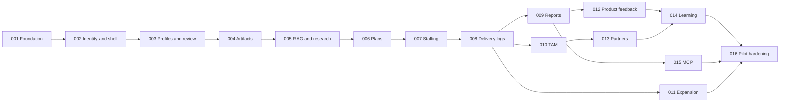

# Turas delivery roadmap

Baseline: 2026-09-26. **001 is the foundation PR; 002–016 are planned, not built.**
Numbers reserve the intended sequence. Create detailed Spec Kit artifacts only
when starting a slice; do not turn the entire product into one implementation PR.
Each slice may need several PRs. No calendar dates are promised before team
capacity, identity/resource choices and initial delivery velocity are known.

## Build sequence

| Spec | Slice | Dependencies | Deliverable and exit evidence |
| --- | --- | --- | --- |
| 001 | Platform foundation | None | Spec Kit, governance, reference audit, blueprint, architecture, templates and roadmap; reproducible checks; reviewed foundation PR |
| 002 | Identity, persistence and application shell | 001 | Next.js/eve shell matching reference; explicit migrations; internal/partner principals and customer grants; owned chat sessions; deny unauthorized stream/resume/control and cross-tenant access |
| 003 | Customer profiles, maturity and context review | 002 | Rich canonical profiles, separate maturity/delivery models, product-use records, research/risk history; pending → approve/reject/correct/retract lifecycle; accepted-only context tests |
| 004 | Chat attachments and artifact ingestion | 003 | Private original files, explicit customer binding, PDF/DOCX/PPTX/XLSX/CSV/text and image paths, extraction status and review queue; retry/idempotency, deletion and malicious-file tests |
| 005 | Governed RAG, research and evidence quality | 004 | Hybrid scoped retrieval with page/sheet/cell citations, quality rubric v1, recon/practices/implementation research boundaries, refresh and contradiction handling; retrieval and citation evals |
| 006 | Delivery plans and technical designs | 005 | Versioned template, context snapshot, architecture artifacts and rationale; accept exact version into customer, milestone baseline and revisions; no duplicate engagement on retry |
| 007 | Skills, staffing and services operations | 006 | Approved structured competency import, availability and constraints, explained matches, manager-confirmed allocations, deterministic utilization/economics; overload and stale-competency tests |
| 008 | Engagement execution and delivery logs | 006, 007 | Milestones, activity/time approval, RAID, scope changes, decision/acceptance/handoff records and outcomes; logs drive status without inventing progress |
| 009 | Weekly and executive reporting | 008 | Reviewed weekly report and recipient policy; monthly/quarterly executive PDF and editable QBR slides; brand/template validation, audience redaction, durable send/retry receipts |
| 010 | TAM and support guidance | 005, 008 | Customer-scoped support readiness, recommended actions, evidence, owner and escalation boundaries; track disposition without pretending to resolve tickets |
| 011 | Product expansion opportunities | 006, 008 | Explainable new-product/usage-expansion hypotheses, prerequisites and proposed engagement; account-owner qualification, dismiss/defer tracking; evidence of customer benefit |
| 012 | Product gaps and engineering feedback | 005, 008, 009 | Canonical gap records, deduplication and unique-customer impact; detailed and summary report templates; restricted aggregates and engineering handoff receipts |
| 013 | Partner delivery and enablement | 006, 008, 010 | Partner workspace for granted accounts, same plan method plus what/how/why lessons and checkpoints; no internal margins or ungranted customer leakage |
| 014 | Governed adaptive learning | 005, 009, 012, 013 | Feedback → reviewed practice candidate → evaluated version → publication/rollback; refresh jobs, cohort privacy, lineage-based invalidation and quality dashboards |
| 015 | Read-only MCP service | 003, 005, 006, 009 | Versioned profile/evidence/plan/report reads through shared policy; scopes, pagination, current authorization, rate limits and consumer contract tests |
| 016 | Pilot hardening and launch readiness | 002–015 | Restore/recovery, retention/deletion, security/access review, scale/cost tests, operational runbooks, pilot feedback and approved release |

## Milestones and review gates

**M0 — Development foundation (001).** Review this plan, merge the foundation PR,
then choose the coding model and begin 002. No product implementation starts merely
because the roadmap is present. Confirm foundation CI and README on merged `main`.

**M1 — Trusted context and planning (002–006).** Demonstrate one synthetic customer
from authorized conversation through document review, cited retrieval and accepted
plan. Unauthorized sessions and draft/retracted evidence must fail closed. Partners'
identity/grant boundaries already exist, even though their enablement UX comes later.

**M2 — Internal delivery pilot (007–011).** Demonstrate skill-aware staffing,
approved work logs, weekly report delivery, executive review, TAM handoff and an
evidence-backed expansion hypothesis. Require a pilot data owner and measured
retrieval/agent quality and operating costs before private customer use.

**M3 — Partner and organizational learning (012–015).** Demonstrate authorized
partner delivery, recurring product-gap evidence, reviewed practice improvement
and an MCP client using the same permissions. No raw cross-customer learning pool.

**M4 — Release readiness (016).** Meet agreed recovery, deletion, performance,
quality, and support criteria. A merged feature is not automatically a production
release. Production rollout is a distinct, reviewable action using eve.

## Dependencies and opportunities to overlap

```mermaid
flowchart LR
  A[001 Foundation] --> B[002 Identity and shell]
  B --> C[003 Profiles and review]
  C --> D[004 Artifacts]
  D --> E[005 RAG and research]
  E --> F[006 Plans]
  F --> G[007 Staffing]
  G --> H[008 Delivery logs]
  H --> I[009 Reports]
  H --> J[010 TAM]
  H --> K[011 Expansion]
  I --> L[012 Product feedback]
  J --> M[013 Partners]
  L --> N[014 Learning]
  M --> N
  I --> O[015 MCP]
  N --> P[016 Pilot hardening]
  O --> P
  K --> P
```

The table is authoritative for all dependencies; the diagram summarizes the main
path. After shared contracts stabilize, 010/011 can progress independently. MCP can
start after 009 without waiting for adaptive learning. Partner access enforcement,
audit, telemetry, testing and recovery are developed throughout; 016 verifies them
under pilot conditions rather than introducing them at the end.

## Immediate 002 handoff

Resolve the blocking decisions in [decision register](docs/decisions.md): identity
provider and partner federation, workspace/customer grants and approvers, isolated
database/Blob resources and region. Verify `channel/web` against installed eve;
its registry scaffold may select preview dependencies. Define owned session
authorization, initial migration and synthetic fixtures, then implement a thin
authenticated shell. Bring the demo's visual system forward without its shared
demo credentials, static customer catalog or request-time schema creation.
Confirm the target Vercel project/domains and align its existing Next.js framework
expectation with this new shell (D18). The foundation's automatic preview currently
fails before build because Next.js is not installed; no unused integration was added.

## Updating this roadmap

Record a slice as in progress when its spec/plan exists, and complete only when
its exit evidence and merged PR are linked. Distinguish local, CI, preview and
production verification. Revise dependencies and scope when evidence changes.
Update README in each relevant PR and verify it after merge.
