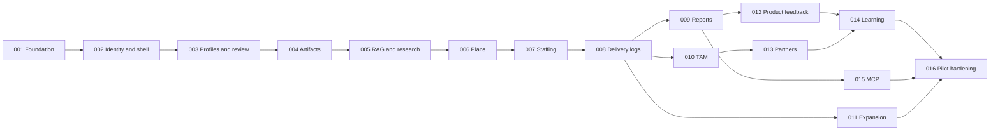

# Turas delivery roadmap

Baseline: 2026-09-26; updated 2026-10-09. **001 merged in PR 1; 002 merged in
[PR 2](https://github.com/mcteer/turas/pull/2) after local and CI validation, without a hosted release. 003 merged in [PR 4](https://github.com/mcteer/turas/pull/4) after local and CI validation, without a hosted release. 004 merged in [PR 6](https://github.com/mcteer/turas/pull/6) after local and CI validation, without a hosted release; 005 merged in [PR 8](https://github.com/mcteer/turas/pull/8) after local and CI validation, without a hosted release. 006 merged in [PR 11](https://github.com/mcteer/turas/pull/11) after local and CI validation, without a hosted release; 007 merged in [PR 13](https://github.com/mcteer/turas/pull/13) after local and CI validation, without a hosted release. 008 merged in [PR 16](https://github.com/mcteer/turas/pull/16) after passing CI; hosted execution acceptance remains separate. 009 merged in [PR 17](https://github.com/mcteer/turas/pull/17); live reporting delivery remains deferred. 010 implementation and acceptance are recorded in [PR 19](https://github.com/mcteer/turas/pull/19); 011 merged in [PR 22](https://github.com/mcteer/turas/pull/22) after local, actual-model independent review and passing CI; 012 merged in [PR 23](https://github.com/mcteer/turas/pull/23); 013 merged in [PR 24](https://github.com/mcteer/turas/pull/24); 014 merged in [PR 25](https://github.com/mcteer/turas/pull/25), with Production schema 054 and internal hosted read checks recorded; 015 implementation is in [PR 28](https://github.com/mcteer/turas/pull/28), with acceptance tracked in its validation record; hosted release remains pending; 016 remains a roadmap proposal.**

Owner-private chat archiving released in [PR 20](https://github.com/mcteer/turas/pull/20).
The [public research remediation](https://github.com/mcteer/turas/pull/21) saved and
indexed the authorized 184-entry public customer inventory in Production; its
application release and hosted UI checks remain separate from the data proof.
011 is merged with local/CI acceptance; hosted release remains separate. 012 is merged in PR 23; local and CI acceptance are tracked in its validation record. 013 merged in PR 24; 014 merged in PR 25, with schema 054 and internal Production read checks recorded; 015 implementation is in [PR 28](https://github.com/mcteer/turas/pull/28), with acceptance tracked in its validation record; hosted release remains pending; 016 remains a proposal.

005 now has [specification](specs/005-governed-rag-research/spec.md),
[design](specs/005-governed-rag-research/plan.md) and
[implementation tasks](specs/005-governed-rag-research/tasks.md) merged in
[PR 8](https://github.com/mcteer/turas/pull/8). Local implementation and validation are complete; the
[validation log](specs/005-governed-rag-research/validation.md) separates focused
local checks, CLI WebKit journeys, the passing 40-query synthetic live
embedding gate, local 5,000-passage hybrid load gate, twelve-case actual
Turi output review and disposable paired recovery drill from hosted validation,
which remains outside this slice.

The user subsequently connected Git/Vercel; protected Previews have basic app smoke
checks. Full hosted workflow/worker acceptance remains release work. Feature 009
planning does not authorize new hosting resources or deployment. Use owned local
validation first; see the [002 plan](specs/002-identity-platform-shell/plan.md) for
the historical local-only boundary.
Numbers reserve the intended sequence. Create detailed Spec Kit artifacts only
when starting a slice; do not turn the entire product into one implementation PR.
Each slice may need several PRs. No calendar dates are promised before team
capacity, identity/resource choices and initial delivery velocity are known.

## Completed 006 implementation

Feature 006 [specification](specs/006-delivery-plans/spec.md),
[plan](specs/006-delivery-plans/plan.md), [research](specs/006-delivery-plans/research.md),
data model, contracts, validation guide and [78 implementation tasks](specs/006-delivery-plans/tasks.md)
govern the merged implementation. Manual authoring, exact human review, replacement,
bounded drafting, native replay/cancellation, source lifecycle, disposable
recovery, the local 1,000-plan performance gate, the four-project WebKit
trusted-context journey and reviewed eight-case live evaluation have passing
local evidence. Preview has been explicitly upgraded to schema 031 and
read-only inspected; [PR 11](https://github.com/mcteer/turas/pull/11) passed its full CI workflow and merged. The feature remains unreleased. See the
[validation log](specs/006-delivery-plans/validation.md) for evidence. The legacy
planning and solution-pattern review is reference material, not runtime proof.

## Completed 007 implementation

Feature 007 [specification](specs/007-skills-staffing/spec.md),
[design](specs/007-skills-staffing/plan.md),
[contracts](specs/007-skills-staffing/data-model.md) and
[tasks](specs/007-skills-staffing/tasks.md) govern the merged implementation.
Reviewed competencies and calendars support explainable matches and exact human
allocation decisions; planned economics and bounded read-only advice retain separate
access rules. Staffing and finance authority belong only to `mcteer`; delegation is
deferred. Actual utilization belongs to 008. The
[validation log](specs/007-skills-staffing/validation.md) records passing local
domain, regression, WebKit, paired recovery, representative load and eight-case
reviewed live-advisory gates. Preview is at schema 034 after explicit migration
and read-only reinspection. [PR 13](https://github.com/mcteer/turas/pull/13)
passed review-head CI and merged; no hosted release is claimed.

## Completed 008 Implementation

The [specification](specs/008-engagement-execution/spec.md),
[design and contracts](specs/008-engagement-execution/plan.md),
[71 tasks](specs/008-engagement-execution/tasks.md) and
[validation guide](specs/008-engagement-execution/quickstart.md) cover reviewed
execution, approved actual time, RAID/scope reconciliation, effort forecasts,
handoff/outcomes and read-only Turi advice. Approval belongs only to `mcteer`, as
confirmed during clarification. Foundation, activity/milestone review, time/actuals, reviewed registers, baseline reconciliation, forecasts,
utilization and handoff/closeout/outcomes are implemented through T049 with disposable domain and four-project WebKit evidence.
Governed advice, exact retained-payload cleanup, actual-output capture and owned
regression/load/recovery tooling are implemented. See the validation log for the
current complete gate and Preview results. Execution migrations 036–038 have explicit
owned upgrade and runtime-role checks; Preview status is recorded separately.
The complete slice merged in [PR 16](https://github.com/mcteer/turas/pull/16).
This checkpoint does not claim hosted execution readiness.

## Completed 009 Implementation

The [specification](specs/009-weekly-executive-reporting/spec.md),
[plan and contracts](specs/009-weekly-executive-reporting/plan.md),
[68 tasks](specs/009-weekly-executive-reporting/tasks.md) and
[validation guide](specs/009-weekly-executive-reporting/quickstart.md) define reviewed
weekly reporting, executive PDF/editable slides, audience/source fences and durable
email delivery. Weekly schedules prepare drafts; the user confirmed mcteer approval for every exact
send. Local reporting implementation is available; the
[validation log](specs/009-weekly-executive-reporting/validation.md) records
source-bound deterministic, artifact, lifecycle, recovery and regression evidence,
including passing final-source four-project WebKit and representative load checks.
Local implementation/testing is complete. The controlled live-send gate
is explicitly deferred by the user (“Resend can come later”) and remains separate
from development completion. Local rendering/provider simulation does not establish real
delivery or hosted readiness. The slice merged in
[PR 17](https://github.com/mcteer/turas/pull/17); its implementation does not include
roadmap 010 or claim real email delivery.

## 010 TAM and Support Guidance

The [specification](specs/010-tam-support-guidance/spec.md),
[plan](specs/010-tam-support-guidance/plan.md) and
[45 tasks](specs/010-tam-support-guidance/tasks.md) govern support readiness,
reviewed owned actions, escalation/human-reported handoff and bounded owner-private
Turi guidance. [PR 19](https://github.com/mcteer/turas/pull/19) delivers the
implementation while preserving merged recovery PR 18. Selected evidence,
original dates and quality are supplied before guidance generation.
The [validation ledger](specs/010-tam-support-guidance/validation.md) records
source-bound domain, native, browser, actual-output, performance, recovery and CI
acceptance. Hosted rollout remains separately authorized. See
[support operations](docs/support-operations.md) for disable, retention and
forward-recovery boundaries. Broader research-specialist and conversation-history
follow-up remains separate.

## 011 Product Expansion Opportunities

The [specification](specs/011-product-expansion/spec.md),
[plan](specs/011-product-expansion/plan.md) and
[51 implementation tasks](specs/011-product-expansion/tasks.md) define internal
customer/workload hypotheses, transparent ranking, evidence-driven review and bounded
Turi proposals. The user confirmed one designated internal account owner per customer,
with assignments managed by `mcteer`. Qualification remains separate from customer
fact approval, maturity, delivery acceptance and commercial commitment.

All four stories are merged in PR 22 with passing deterministic/browser checks, all eight configured-provider cases independently reviewed, and all 16 CI jobs passing. Production migrations 046–047 were applied in the [2026-10-09 recovery](docs/production-recovery-2026-10-09.md); full hosted expansion acceptance remains unverified. See the [validation record](specs/011-product-expansion/validation.md).

## 012 Product Gaps and Engineering Feedback

The [specification](specs/012-product-gap-feedback/spec.md), [plan](specs/012-product-gap-feedback/plan.md) and [52 implementation tasks](specs/012-product-gap-feedback/tasks.md) cover canonical gap/impact records, explicit merge/split, distinct-customer counts, deterministic engineering detail/portfolio reports and manual handoff. Internal members propose; only canonical active internal administrator `mcteer` reviews and authorizes disclosure/handoff. Private Markdown/JSON exports introduce no automatic send or new agent behavior. The four stories merged in [PR 23](https://github.com/mcteer/turas/pull/23). Complete local and CI acceptance is recorded separately in the validation record; Production is on schema 051 and internal Product Gaps page/API checks passed in the [2026-10-09 recovery](docs/production-recovery-2026-10-09.md); full hosted engineering-report acceptance remains unverified. See the [handoff](specs/012-product-gap-feedback/handoff.md).

## 013 Partner Delivery and Enablement

The [specification](specs/013-partner-enablement/spec.md),
[plan](specs/013-partner-enablement/plan.md) and
[48 implementation tasks](specs/013-partner-enablement/tasks.md) cover a partner
workspace using existing delivery workflows, reviewed customer-scoped guides and
individual training checkpoints. The user confirmed mcteer verification of partner
submissions. Individual customer grants remain authoritative; shared knowledge
uses 005's sanitized publications. Local implementation includes explicit 050/051 migrations and owned synthetic
validation runners. See the [validation record](specs/013-partner-enablement/validation.md) for local
and CI outcomes. Feature 013 merged in [PR 24](https://github.com/mcteer/turas/pull/24).
Production is on schema 051 and internal Partner Delivery page/API checks passed;
full partner-role and workflow acceptance remains unverified. Agent model selection is unchanged. See the
[handoff](specs/013-partner-enablement/handoff.md).

## 014 Governed Adaptive Learning

The [specification](specs/014-governed-adaptive-learning/spec.md),
[plan](specs/014-governed-adaptive-learning/plan.md) and
[66 tasks](specs/014-governed-adaptive-learning/tasks.md) cover private feedback,
budgeted Turi drafting and fixed paired evaluation, administrator publication and
reviewed rollback, internal-only fixed-quarter metrics and bounded refresh/quality
views. Two user decisions are recorded: internal-only aggregate metrics; Turi drafts
and evaluates while administrators publish. Existing 005 authorities are preserved.
Implementation acceptance includes explicit 052–054 migrations, workspace activation, complete owned CI gates and authorized actual-model review. Production schema 054 is activated; internal hosted read checks passed, with partner login/access boundaries validated and record-dependent write coverage limits documented in the [validation record](specs/014-governed-adaptive-learning/validation.md). The [handoff](specs/014-governed-adaptive-learning/handoff.md)
provides feature selection and acceptance requirements.

## Build sequence

| Spec | Slice | Dependencies | Deliverable and exit evidence |
| --- | --- | --- | --- |
| 001 | Platform foundation | None | Spec Kit, governance, reference audit, blueprint, architecture, templates and roadmap; reproducible checks; reviewed foundation PR |
| 002 | Identity, persistence and application shell | 001 | Next.js/eve shell matching reference; explicit migrations; internal/partner principals and customer grants; owned chat sessions; deny unauthorized stream/resume/control and cross-tenant access |
| 003 | Customer profiles, maturity and context review | 002 | Rich canonical profiles with internal-wide visibility and partner delivery-only projections, separate maturity/delivery models, product-use records, research/risk history; pending → approve/reject/correct/retract lifecycle; accepted-only context tests |
| 004 | Chat attachments and artifact ingestion | 003 | Private original files, explicit customer binding, PDF/DOCX/PPTX/XLSX/CSV/text and image paths, extraction status and review queue; retry/idempotency, deletion and malicious-file tests |
| 005 | Governed RAG, research and evidence quality | 004 | Hybrid scoped retrieval with page/sheet/cell citations, reviewed sanitized shared practices/solutions available to all active users, private source lineage, quality rubric v1, recon/practices/implementation research boundaries, refresh and contradiction handling; retrieval and citation evals |
| 006 | Delivery plans and technical designs | 005 | Versioned template, authorized customer context plus eligible shared practices, architecture artifacts and rationale; accept exact version into customer, milestone baseline and revisions; no duplicate engagement on retry |
| 007 | Skills, staffing and services operations | 006 | Approved structured competency import, availability and constraints, explained matches, manager-confirmed allocations, deterministic utilization/economics; overload and stale-competency tests |
| 008 | Engagement execution and delivery logs | 006, 007 | Milestones, activity/time approval, RAID, scope changes, decision/acceptance/handoff records and outcomes; logs drive status without inventing progress |
| 009 | Weekly and executive reporting | 008 | Reviewed weekly report and recipient policy; monthly/quarterly executive PDF and editable QBR slides; brand/template validation, audience redaction, durable send/retry receipts |
| 010 | TAM and support guidance | 005, 008 | Customer-scoped support readiness, recommended actions, evidence, owner and escalation boundaries; track disposition without pretending to resolve tickets |
| 011 | Product expansion opportunities | 006, 008 | Explainable new-product/usage-expansion hypotheses, prerequisites and proposed engagement; account-owner qualification, dismiss/defer tracking; evidence of customer benefit |
| 012 | Product gaps and engineering feedback | 005, 008, 009 | Canonical gap records, deduplication and unique-customer impact; detailed and summary report templates; restricted aggregates and engineering handoff receipts |
| 013 | Partner delivery and enablement | 006, 008, 010 | Partner workspace for assigned-customer delivery data plus platform-wide published shared knowledge, same plan method plus what/how/why lessons and checkpoints; no internal margins or ungranted customer leakage |
| 014 | Governed adaptive learning | 005, 009, 012, 013 | Extend the 005 shared-knowledge publication path: feedback → reviewed practice candidate → evaluated version → publication/rollback; refresh jobs, cohort privacy, lineage-based invalidation and quality dashboards |
| 015 | [Read-only MCP service — release pending](specs/015-read-only-mcp/spec.md) | 003, 005, 006, 009 | Versioned profile/evidence/plan/report reads through shared policy; scopes, pagination, current authorization, rate limits and consumer contract tests |
| 016 | Pilot hardening and launch readiness | 002–015 | Restore/recovery, retention/deletion, security/access review, scale/cost tests, operational runbooks, pilot feedback and approved release |

## Milestones and review gates

**M0 — Development foundation (001).** Review this plan, merge the foundation PR,
then choose the coding model and begin 002. No product implementation starts merely
because the roadmap is present. Confirm foundation CI and README on merged `main`.

**M1 — Trusted context and planning (002–006).** Demonstrate one synthetic customer
from authorized conversation through document review, cited retrieval and accepted
plan. Unauthorized sessions and draft/retracted evidence must fail closed. Partners'
identity/grant boundaries already exist, even though their enablement UX comes later.

**M2 — Internal delivery pilot (007–011).** Demonstrate skill-aware staffing,
approved work logs, weekly report delivery, executive review, TAM handoff and an
evidence-backed expansion hypothesis. Require a pilot data owner and measured
retrieval/agent quality and operating costs before private customer use.

**M3 — Partner and organizational learning (012–015).** Demonstrate authorized
partner delivery, recurring product-gap evidence, reviewed practice improvement
and an MCP client using the same permissions. No raw cross-customer learning pool.

**M4 — Release readiness (016).** Meet agreed recovery, deletion, performance,
quality, and support criteria. A merged feature is not automatically a production
release. Production rollout is a distinct, reviewable action using eve.

## Dependencies and opportunities to overlap

```mermaid
flowchart LR
  A[001 Foundation] --> B[002 Identity and shell]
  B --> C[003 Profiles and review]
  C --> D[004 Artifacts]
  D --> E[005 RAG and research]
  E --> F[006 Plans]
  F --> G[007 Staffing]
  G --> H[008 Delivery logs]
  H --> I[009 Reports]
  H --> J[010 TAM]
  H --> K[011 Expansion]
  I --> L[012 Product feedback]
  J --> M[013 Partners]
  L --> N[014 Learning]
  M --> N
  I --> O[015 MCP]
  N --> P[016 Pilot hardening]
  O --> P
  K --> P
```

The table is authoritative for all dependencies; the diagram summarizes the main
path. After shared contracts stabilize, 010/011 can progress independently. MCP can
start after 009 without waiting for adaptive learning. Partner access enforcement,
audit, telemetry, testing and recovery are developed throughout; 016 verifies them
under pilot conditions rather than introducing them at the end.

## Current 002 work

Use `panel`, `mcteer` and `partner` demo login for 002, per the 2026-09-27 clarification;
full authentication and partner federation are deferred until explicitly resumed
following hiring. Preserve authorization boundaries and partner fixture tests.
Account roles and grants, isolated Postgres migrations, the private conversation
path, the reference-style shell and local worker are merged, with completed
[002 tasks](specs/002-identity-platform-shell/tasks.md) and
[validation evidence](specs/002-identity-platform-shell/validation.md).
Confirm the target Vercel project/domains, align the
Next.js build and validate hosted behavior only at replacement readiness (D18).
The foundation's earlier preview failure is historical; the repo is now disconnected.

## Completed 003 work

The [003 specification](specs/003-customer-profile-review/spec.md) defines rich
customer/workload profiles, independent maturity assessments, governed context
review, evidence quality and partner delivery-only projections. Clarification is
recorded in the spec. The [implementation plan](specs/003-customer-profile-review/plan.md),
research, data model, interface contracts and validation guide are complete.
The [task breakdown](specs/003-customer-profile-review/tasks.md) is generated;
analysis findings have been remediated. Typed profile and review flows, bound
customer context, synthetic research, conflict review and partner projections
have passed local domain, HTTP and four-project WebKit checks. Guarded 006 upgrade
and restored-clone drills also pass. A guarded 25-record synthetic walkthrough
fixture is ready. The feature merged in [PR 4](https://github.com/mcteer/turas/pull/4).
The scripted populated-profile journey passed in all four WebKit projects.
Validation evidence is recorded in the [003 validation log](specs/003-customer-profile-review/validation.md).
Hosted validation and release remain deferred until replacement readiness.

## Completed 004 work

The [004 specification](specs/004-chat-artifact-ingestion/spec.md),
[plan](specs/004-chat-artifact-ingestion/plan.md), research, data model and contracts
are merged. The [64-task breakdown](specs/004-chat-artifact-ingestion/tasks.md)
covers private local intake and isolated scan/extraction, selected evidence review,
unverified chat context, and versioned source lifecycle/cleanup. Local and CI
validation passed before [PR 6](https://github.com/mcteer/turas/pull/6) merged; the selected
application database remains at its prior schema until explicit migration.
The conservative original-file visibility default remains an unconfirmed
planning assumption. See the [validation log](specs/004-chat-artifact-ingestion/validation.md)
for checks actually completed.

Hosted Blob/Sandbox adapters, RAG and competency import remain later work. Local
acceptance used real synthetic scan/parser fixtures, access/race tests, CLI
WebKit and bounded agent evaluations, without a participant-count gate.

## Updating this roadmap

Record a slice as in progress when its spec/plan exists, and complete only when
its exit evidence and merged PR are linked. Distinguish local, CI, preview and
production verification. Revise dependencies and scope when evidence changes.
Update README in each relevant PR and verify it after merge.
