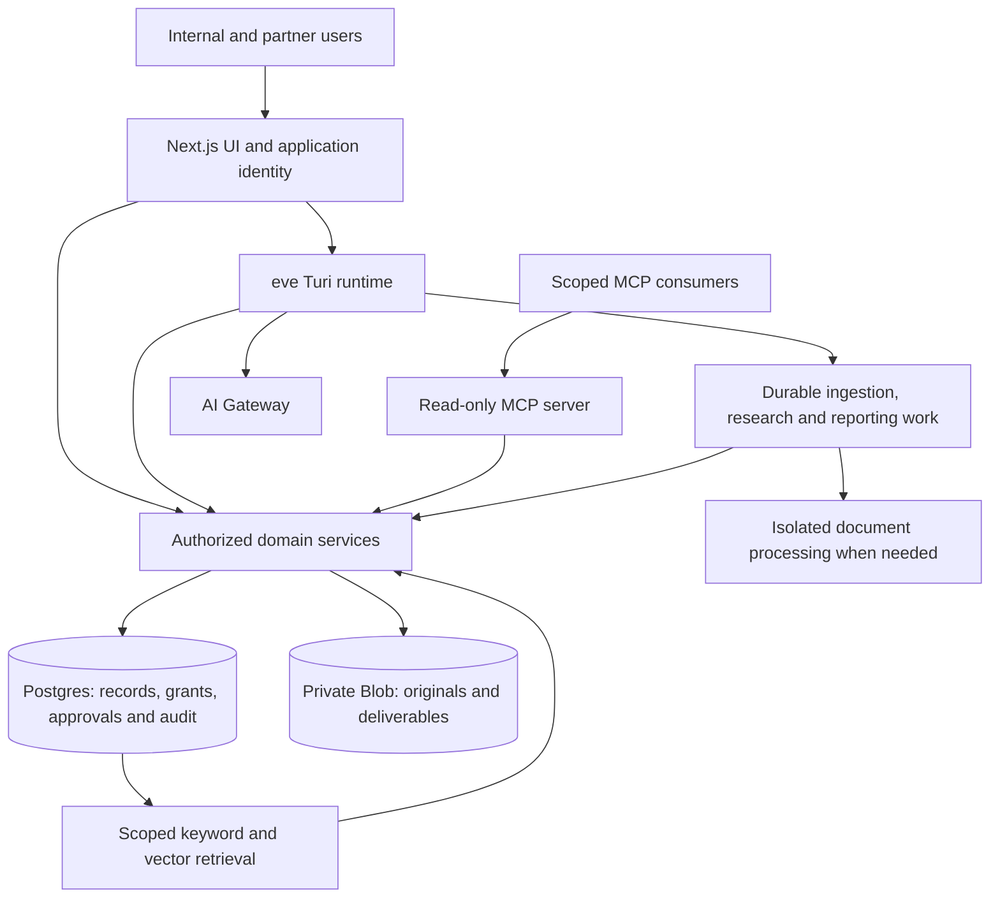

# Proposed Turas architecture

Status: design baseline, not provisioned infrastructure. Verified against installed
eve 0.67.1 documentation and current primary product documentation on 2026-09-26.
Preserve the existing root model selection. Recheck compatibility within each spec.

## Responsibilities and data flow

Use one Next.js application and eve's documented `withEve` integration for the UI
and agent services in one Vercel project. The frontend consumes `eve/react`; do not
rebuild eve's stream protocol. This is a proposed topology, not code added in 001.
See installed `guides/frontend/nextjs.mdx` and `guides/frontend/overview.mdx`.

## Product choices and installation gates

| Concern | Proposed choice | First actual use / condition |
| --- | --- | --- |
| Agent core | Existing eve runtime, AI SDK and AI Gateway | Scaffold exists; no model changes in 001 |
| Web app and previews | Next.js + Vercel hosting through eve | 002, after compatibility review of `channel/web` |
| Identity | Three demo logins with shared server authorization; full provider integration deferred | 002 uses mcteer (internal admin), panel (internal employee) and partner (external member) per user clarification; platform protection is not app authorization |
| Authoritative records | Local Postgres 17 for 002; Neon selected for future hosted storage | Explicit migrations and isolated resources; no hosted provisioning in planning |
| Semantic search | Postgres pgvector plus full-text retrieval | 005, only after scoped evidence contracts exist |
| Private artifacts | Private local filesystem adapter in 004; private Vercel Blob proposed for hosted readiness | 004 validates local authorization/lifecycle; hosted adapter only when provisioned and exercised |
| Durable execution | eve's Workflow-backed execution | Per active multi-step feature; no duplicate orchestration framework |
| Untrusted extraction | Per-job isolated Docker scan/parser in 004; Vercel Sandbox considered at hosted readiness | Real local scanner/parsers and network/resource limits; no unused hosted adapter |
| External-service access | Native eve integration first, Connect where appropriate | Only the feature that actually reads/writes that service |
| Scheduling and reports | Durable jobs with explicit recipient policy | 009; no unused mail/chat connector installed early |
| MCP publication | Dedicated read-only MCP endpoint, candidate `mcp-handler` | 015, after consumer/auth contract and registry review |
| Observability | Structured app/runtime telemetry; Vercel observability as useful | Add instrumentation with each feature; no customer prompt logging by default |
| Queues, extra caches or services | No initial commitment | Only with a measured need not covered by current components |

**Installation rule:** no new eve integration is installed in the foundation.
Registry inspection is research, not setup. Every future integration PR identifies
the live call site, permissions, configuration, test, and failure path. Do not port
the demo's unused Linear, Notion, GitHub, browser, or memory integrations by default.
An integration is not a prerequisite merely because its credentials are present.

The initial scaffold already declares `@vercel/connect`; 001 preserves the scaffold
dependency graph. It does not configure a connector. Review actual dependency needs
when 002 establishes the runtime; do not conflate a package with an installed service.

## Identity and authorization

Authenticate the UI and eve channel against one verified application identity.
eve route authentication does **not** enforce session ownership. Turas must authorize
session creation, stream/replay, follow-up, resume, cancellation and controls against
owned/shared session records. `auth.current` can change on follow-up; `auth.initiator`
does not grant a later caller the creator's authority.

Carry environment, workspace, principal, customer and partner grants through domain
services and jobs. Revalidate current access at execution, retrieval and send time;
do not rely on a stale serialized job identity. Establish field-level policies for
commercial data, personnel costs, internal notes and customer-approved reports.
Denial must not leak existence, counts, signed Blob URLs or citations for hidden data.
Search, embeddings, caches and exports follow the same policy as primary records.

Internal profile visibility spans all customers in the user's workspace, including
non-delivery use; chat ownership remains separate. Partner customer assignments
permit only delivery-relevant projections, not whole internal profiles. Enforce
field projection before retrieval, serialization and agent context construction.

Shared product knowledge has its own reviewed publication scope, readable by all
active platform users including partners. Store sanitized, versioned knowledge
separately from restricted source lineage; index only the published representation
for platform-wide retrieval. A shared citation resolves to that representation and
does not expose a source customer's identifiers or artifacts. Combine eligible shared
knowledge with authorized customer-delivery context when proposing guidance. The
[evidence policy](evidence-policy.md#shared-product-knowledge) defines publication
and correction/withdrawal behavior; 005 introduces this path and 014 automates its
improvement. No raw cross-customer retrieval followed by output-only redaction.

## Authoritative records and artifacts

Postgres owns durable business entities, immutable revisions and approvals. Agent
session memory is conversational context, not the customer system of record. Use
explicit migration files and a controlled migration command. Avoid the demo's
CREATE/ALTER-on-request approach. SQL/vector indexes and report snapshots are
derived projections whose eligibility is checked against authoritative revisions.

004 plans a private local ArtifactStore adapter for original versions; the proposed
hosted design uses private Blob when it can be provisioned and verified. SQL holds
ownership, classification, digest, ingestion status, evidence links and retention. Storage
authentication does not replace Turas customer authorization. Authorize before
issuing any upload token or short-lived download capability. Use separate dev,
preview and production resources. Never reuse the demo database automatically.
The [004 design](../specs/004-chat-artifact-ingestion/plan.md) uses isolated local
containers and a separately supervised worker while deployment remains disabled.
Hosted Blob intake will need direct client uploads for files above the Functions
request-body limit; local streaming uploads do not prove hosted compatibility.

## Agent and durable workflow boundaries

Turi orchestrates bounded tools and explains evidence-backed decisions. Typed tools
call domain services; models do not issue unrestricted SQL or hold administrative
connector access. Reintroduce three specialist roles only in 005 when used:
customer recon, Vercel practices research, and implementation synthesis. Return
typed artifact references with authenticated provenance rather than copying entire
research transcripts into every prompt.

Workflow retries require domain idempotency, not faith in “exactly once” execution.
Version-check plan acceptance and context review; record external-send attempts and
receipts in a transactional outbox or equivalent. Bound time, cost, retries and
concurrency; support cancellation and incomplete results. Scheduled jobs prepare
persisted drafts or follow an already authorized send policy. Do not expect an
unattended Markdown schedule to conduct an interactive approval conversation.

## MCP is an outbound data interface

eve `connections/` call other MCP servers; they do not expose Turas records. Feature
015 creates a separate initially read-only server over the same domain reads.
Define versioned tools/resources such as profile, evidence search, engagement plan
and report retrieval. Enforce token audience/scopes and customer grants, pagination,
response limits, source citations and audit. Do not expose SQL or administrative
tools. Select current protocol/SDK versions when implementing the MCP spec.

## Primary references

- [eve documentation](https://eve.dev/docs); installed task routing in
  `node_modules/eve/docs/README.md`, auth in `guides/auth-and-route-protection.md`,
  workflows in `tools/workflows.mdx`, scheduling in `schedules.mdx`.
- [Postgres on Vercel](https://vercel.com/docs/postgres) and
  [pgvector](https://github.com/pgvector/pgvector). Vercel Postgres is retired;
  specify the selected Marketplace provider rather than naming a nonexistent service.
- [Private Blob](https://vercel.com/docs/vercel-blob/private-storage),
  [AI Gateway](https://vercel.com/docs/ai-gateway), and
  [Workflows](https://vercel.com/docs/workflows).
- [MCP deployment](https://vercel.com/docs/mcp/deploy-mcp-servers-to-vercel) and
  [MCP OAuth guidance](https://vercel.com/i/mcp-server-oauth-authorization).
