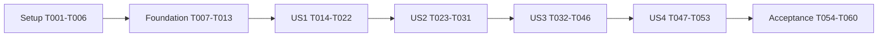

# Tasks: Identity, persistence and application shell

**Input**: [spec.md](spec.md), [plan.md](plan.md), [research.md](research.md),
[data-model.md](data-model.md), [application contract](contracts/application.md),
[eve contract](contracts/eve-session.md), [recovery and validation contract](contracts/recovery-and-validation.md), [quickstart](quickstart.md).
**Status**: All tasks completed; merged in PR 2 after local and CI validation.
Hosted application checks remain deferred in validation.md.
**Tests**: Explicitly required by the specification's acceptance scenarios and SC-001
through SC-009. Write the listed behavior tests before their implementation and
confirm a meaningful failure; rerun to green at the story checkpoint.

## Format and execution rules

Each task uses `- [ ] Tnnn [P?] [USn?] description with repository-relative paths`.
`[P]` permits parallel work only within the named phase's test/configuration batch,
after that phase's prerequisites are complete. Unmarked tasks run in listed order.
Paths in backticks are planned files, not claims they already exist. Quoted schema
constraints reproduce the data model; implement required fields and state checks,
not just TypeScript declarations. See dependencies and coverage below.

Before framework changes, read installed `node_modules/eve/docs/README.md` and the
routed page. Preserve `agent/agent.ts` and its model. Add only dependencies used by
this feature; no unused eve integrations, SSO, uploads, research tools or profile CRUD.
Keep credentials outside source control and output. No harness authorship attribution.

The repository stays disconnected from Vercel. All feature checkpoints are local/CI;
no `eve link`, deployment, hosted provisioning, reconnection, project-setting change
or domain cutover. Root `npm run dev` remains the local testing entry point.

## Phase 1: Setup

**Purpose**: Minimal Next.js/eve composition and verification tooling.

- [X] T001 Add the plan's used runtime/test dependencies to `package.json` and `package-lock.json`, resolving Next.js 16.3.4/React 19.2.6 against installed eve 0.67.1 on Node 24; preserve the selected model and record necessary version deviations in `specs/002-identity-platform-shell/research.md` without running a broad scaffold installer.
- [X] T002 Compose the root app with documented `withEve` in `next.config.ts`, add `app/layout.tsx` and a minimal `app/page.tsx`, and configure `tsconfig.json` so shared Node/Web-standard server modules compile in Next.js and eve without importing Next-only runtime APIs into the agent.
- [X] T003 Update `package.json` so root `npm run dev` launches Next.js plus eve, preserve `dev:eve`, and add local compile-only `build:check` composition in `scripts/build-check.mjs`; wire test:unit/test:integration/test:contracts/test:ui during setup so story checkpoints are runnable; keep deploy commands unused and distinguish compilation from sandbox-prewarmed deployment evidence.
- [X] T004 [P] Configure Vitest in `vitest.config.ts` and deterministic runtime/isolated Postgres helpers in `tests/fixtures/runtime.ts` and `tests/fixtures/database.ts`; prevent test helpers from loading demo/production DB URLs or making paid model calls by default.
- [X] T005 [P] Configure CLI-only WebKit in `playwright.config.ts` and `tests/fixtures/ui.ts`, with local base URL, synthetic login fixtures, both themes, 390px/1440px viewports, and sanitized screenshots; use installed WebKit without operating the host browser.
- [X] T006 Add and run `tests/contracts/eve-wrapper-compatibility.test.ts` against the installed public channel types/native response format to prove wrapper composition, status/header preservation and local build compatibility; record results in `specs/002-identity-platform-shell/validation.md` before implementing dependent session behavior.

**Checkpoint**: Root local startup and both compiler targets work; deterministic test
infrastructure exists. Any incompatible public eve API is resolved in design before
proceeding, not hidden behind an untested protocol rewrite.

## Phase 2: Foundational prerequisites

**Purpose**: Shared persistence, identity records and error boundaries. Complete this
phase before story implementation. Customer grants and chat schema remain in their stories.

- [X] T007 Implement validated server-only configuration in `lib/server/config.ts` and document names only in `.env.example`: explicit app origin/environment, runtime/direct DB connections, exact `mcteer`, `panel` and `partner` credential pairs (including planned PARTNER_USERNAME/PARTNER_PASSWORD), and server-only TURAS_MAINTENANCE_SECRET; missing/unsafe configuration fails closed and never falls back to demo resources.
- [X] T008 Implement parameterized `pg` access and transaction helpers in `lib/server/db/client.ts` and environment/schema checks in `lib/server/db/readiness.ts`; use one checked-out client per transaction, a 5s authority-query timeout, no request-time DDL, and no process-memory authorization fallback.
- [X] T009 Create `migrations/001-identity-foundation.cjs` for Environment (singleton environment_id, schema_version: "Must match configured environment; separate DB per data environment"), Principal (id, login_name, display_name, active, revision, created_at: "Unique login; three seeded demo principals; credential values outside table/source"), Workspace (id, name, active: "One visible demo workspace; additional test fixtures"), Partner organization (id, workspace_id, name, active: "Workspace-scoped; no automatic grants"), and Membership (id, principal_id, workspace_id, kind internal/partner, partner_org_id, role admin/member, active, revision: "Unique principal/workspace; partner kind requires organization in same workspace"); encode foreign keys, required fields, enums and indexes from `data-model.md`.
- [X] T010 Add explicit migration commands in `scripts/db-migrate.ts`, `scripts/db-role-setup.sql` and `package.json`, plus `migrations/manifest.json`; use node-pg-migrate's ledger/serialization lock, verify immutable file digests, require explicit environment initialization, and enforce "Managed by migration CLI; runtime cannot mutate" for ledger identifier/applied_at and the release manifest.
- [X] T011 Implement shared validated response/error helpers in `lib/contracts/http.ts` and content-free correlation logging in `lib/server/observability.ts`; preserve 401/403/404/409/413/422/429/503 distinctions, no-store responses, indistinguishable hidden/missing records, and omit credentials, message bodies and reasoning.
- [X] T012 Implement explicit identity bootstrap in `scripts/bootstrap-demo.ts` with fixed UUIDs and synthetic test memberships in `tests/fixtures/identities.ts`; seed mcteer internal Vercel admin (FDE/PS leadership), panel internal Vercel employee/member and partner external member with an active synthetic partner organization in one visible workspace, never reseed disabled records, never infer identity from changed credentials, and expose `db:bootstrap-demo` in `package.json`.
- [X] T013 Add `/api/health/ready` in `app/api/health/ready/route.ts` and verify clean setup, environment mismatch, missing schema, DB failure and non-DDL runtime permissions in `tests/integration/foundation.test.ts`; the public response exposes no connection details and fixtures cover two workspaces/two partner organizations.

**Checkpoint**: Clean disposable initialization succeeds; an unavailable/wrong DB fails
closed; startup cannot migrate or silently seed. Principals are stable and not passwords.

## Phase 3: US1 — Enter and leave an authorized workspace (P1, first MVP)

**Goal**: All three configured accounts can sign in, identify their workspace and sign out.
**Independent test**: No model/customer content required. Admit correct credentials,
deny unknown/invalid/disabled/expired sessions, verify sign-out and missing-config failure.

### Tests

- [X] T014 [P] [US1] Add credential/session/CSRF/rate boundary tests in `tests/unit/auth.test.ts`, including stable IDs across credential changes, missing config, generic login failures, 8h absolute expiry, token rotation, constant-time credential comparison behavior and no default local bypass.
- [X] T015 [P] [US1] Add login/logout/session contract and WebKit journey tests in `tests/contracts/auth.test.ts` and `tests/ui/login.spec.ts`, covering same-origin mutations, rejected external return URLs, cookie flags, disabled membership, cleared protected state and no customer metadata disclosure.

### Implementation

- [X] T016 [US1] Create `migrations/002-login-sessions.cjs` and update `migrations/manifest.json` for Login session (id, principal_id, token_hash, created_at, expires_at, revoked_at: "Unique 32-byte SHA-256 token hash; absolute 8h lifetime; no plaintext token") and Rate window (environment_id, key_hash, category, window_start, count, expires_at: "Unique category/key/window; atomic update; no raw password/token/IP"); index token lookup and enforce required timestamps/state constraints.
- [X] T017 [US1] Implement the three-account credential adapter in `lib/server/auth/credentials.ts` using complete configured account pairs and constant-time comparison of derived values; resolve seeded identities, check active membership, reject alternate/public accounts, and leave future SSO mapping explicit.
- [X] T018 [US1] Implement opaque random 32-byte tokens and session repository in `lib/server/auth/sessions.ts` plus origin/CSRF validation in `lib/server/auth/csrf.ts`; persist only SHA-256 hashes, rotate on login, enforce "active → expired or revoked; no revival or sliding expiry", and set HttpOnly/SameSite=Lax/host-only cookies with hosted Secure behavior.
- [X] T019 [US1] Implement DB-backed login throttling in `lib/server/auth/rate-limit.ts`: 5 failed logins/15min per account+IP and 30/15min per IP, atomically keyed by hashed identifiers; return Retry-After and fail unavailable if persistence fails.
- [X] T020 [US1] Implement `app/api/auth/login/route.ts`, `app/api/auth/logout/route.ts` and `app/api/auth/session/route.ts` using shared server guards, body validation, origin checks and session-bound CSRF; ensure logout is idempotent and clears/revokes the cookie and only current active identity/workspace/capabilities are returned.
- [X] T021 [US1] Build `app/login/page.tsx`, `app/login/login-form.tsx` and `app/(workspace)/layout.tsx`, replacing the temporary public `app/page.tsx` with an authenticated `app/(workspace)/page.tsx`; provide labeled credentials, loading/error feedback, identity/sign-out controls and constrained return paths without exposing an unguarded duplicate root route.
- [X] T022 [US1] Add explicit session-revocation/expired-session cleanup maintenance in `scripts/auth-maintenance.ts`, then run T014–T015 against a real disposable DB and local WebKit; record sign-in/out, credential rotation with session revocation and no-model evidence in `specs/002-identity-platform-shell/validation.md`.

**Checkpoint**: US1 is a usable local login/workspace MVP; it makes no claims about
customer grants or conversations that have not shipped.

## Phase 4: US2 — Grant and revoke bounded customer access (P1)

**Goal**: mcteer manages account/customer access; panel sees all workspace customers and partner sees only assigned customers.
**Independent test**: With identity fixtures and minimal customers, validate grants,
revocation, last-admin protection and partner/workspace denial without a model call.

### Tests

- [X] T023 [P] [US2] Add the permission matrix in `tests/unit/access-policy.test.ts` for active/disabled principal, membership and partner organization, ungranted customers, wrong workspace, internal access to all current/future workspace customers without grants, partner assignment enforcement, delivery-relevant partner projections and separate conversation-owner checks with fixture records; internal profile access must never imply access to other users' chats.
- [X] T024 [P] [US2] Add grant/admin/customer API tests in `tests/contracts/access.test.ts` and `tests/integration/grant-concurrency.test.ts`, covering panel/partner denial, hidden-ID responses, stale revisions, duplicate commands, simultaneous last-admin disable attempts, exact customer-reference response keys (ID, display name, synthetic label) excluding internal metadata, and atomic audit/change writes.

### Implementation

- [X] T025 [US2] Create `migrations/003-customer-access.cjs` and update `migrations/manifest.json` for Customer reference (id, workspace_id, display_name, synthetic, created_at: "Nonempty name <=200 chars; synthetic fixture marker; no maturity/profile fields"), Customer grant (id, membership_id, workspace_id, customer_id, state active/revoked, revision, granted_by, changed_at: "Unique membership/customer; composite FKs enforce common workspace; partner members only"), and Access audit (id, actor_principal_id nullable, actor_session_id nullable, scope_ids, action, outcome, correlation_id, created_at: "Append-only under app role; omit content and credentials; unknown login actor may be null"); add revision/index constraints and durable administrative request deduplication records.
- [X] T026 [US2] Implement current-state authorization in `lib/server/access/policy.ts` and extend `scripts/bootstrap-demo.ts` with labeled synthetic references and internal membership granting all current/future workspace customers and explicit partner assignments to a limited subset (one shared granted customer and one denied customer); preserve revoked grants/disabled records on every rerun and validate composite workspace/partner boundaries inside mutations.
- [X] T027 [US2] Implement revisioned access services and append-only audit in `lib/server/access/service.ts` and `lib/server/access/audit.ts`: "absent → active → revoked → active", expectedRevision conflict, atomic audit/idempotency, auth/login/disable audit integration without content or secrets, explicit reactivation, and a locked check that prevents disabling the final active administrator.
- [X] T028 [US2] Implement `app/api/admin/access/route.ts`, `app/api/admin/memberships/[id]/route.ts`, `app/api/admin/grants/[membershipId]/[customerId]/route.ts` and `app/api/admin/audit/route.ts`; admit only mcteer, enforce origin/CSRF and workspace scope, return metadata only and never use admin status to authorize chat reads.
- [X] T029 [US2] Implement granted customer pagination in `lib/server/access/customers.ts` and `app/api/customers/route.ts`, plus explicit setup-only reference creation in `scripts/create-demo-customer.ts`; enforce <=200-character names, synthetic labels, default 25/max 50 pages and automatic internal visibility and explicit partner assignment grants, without partner wildcard access or profile CRUD; serialize only ID, display name and synthetic label rather than whole persistence rows.
- [X] T030 [US2] Build customer directory/selection and admin access UI in `app/(workspace)/customers/page.tsx`, `app/(workspace)/admin/access/page.tsx` and `app/_components/access-editor.tsx`; show useful no-grant/error states and revision conflicts, with admin controls absent for panel and partner and server enforcement behind them.
- [X] T031 [US2] Run T023–T024 and add `tests/ui/access.spec.ts` for mcteer partner-grant changes, panel/partner admin denial, internal visibility of newly created customers and partner customer isolation; confirm bootstrap does not restore revocations, write evidence to `specs/002-identity-platform-shell/validation.md`, and retain conversation stream integration assertions for US3.

**Checkpoint**: Access administration and customer selection work independently of
chat. The same policy must govern US3's direct eve/session endpoints.

## Phase 5: US3 — Continue a private customer conversation (P1)

**Goal**: Select a granted customer, send/stop/reconnect and retain private history.
**Independent test**: All three accounts with granted and ungranted customers plus deterministic eve responses exercise
creation, reload, restart, lost receipts, ownership and cancellation; real local
runtime/model smoke is also required before feature acceptance.

### Tests

- [X] T032 [P] [US3] Add direct and same-origin native route tests in `tests/contracts/eve-session.test.ts` plus application conversation tests in `tests/contracts/conversations.test.ts`, covering all method/path policies, cookie ownership/grants, unsupported controls/info/uploads/forwarded auth/task input, native headers/cursors and no localDev fallback.
- [X] T033 [P] [US3] Add persistence/failure-injection tests in `tests/integration/conversation-delivery.test.ts` for duplicate request keys, conflicting input, parked-session create races, lost create/follow-up receipts, pre/post-admission DB failures, hook outage, restart and no automatic redispatch of uncertain attempts; include combined lost send receipt plus failed hook write recovered only from the pre-dispatch cursor/native stream, earlier identical text, missing optional deliveryIds and ambiguous/no-event cases from contracts/recovery-and-validation.md.
- [X] T034 [P] [US3] Add streaming tests in `tests/integration/stream-revocation.test.ts` for active/quiet stream revocation <=30s, 5s authority-check timeout, logout/expiry/disabling, reconnect denial, cleanup, stale cancellation and correct partial/terminal state; add `tests/integration/watchdog.test.ts` for restart before/after deadline, duplicate workers/expired leases, stale heartbeat/new-send denial, owner disablement, lost cancel receipt, stale-turn no-op and maintenance signature/nonce rejection.

### Implementation

- [X] T035 [US3] Create `migrations/004-conversations.cjs` and update `migrations/manifest.json` for conversations, submitted messages, response attempts, event projections, watchdog jobs, maintenance-worker heartbeats and consumed maintenance nonces exactly as defined in `data-model.md` and `contracts/recovery-and-validation.md`; include pre-dispatch cursor/digest correlation, input event identity, persisted deadlines, atomic replay cursor updates, unique request/attempt/job/nonce constraints and immutable ownership/binding invariants.
- [X] T036 [US3] Implement owned conversation/message/attempt repository and schemas in `lib/server/conversations/repository.ts` and `lib/contracts/conversations.ts`; enforce immutable associations, required fields and allowed state transitions from `data-model.md`, title <=120 characters, search <=100 characters, default 25/max 50 pagination with timestamp+UUID cursors, current grants and no cross-owner admin bypass.
- [X] T037 [US3] Implement parked-session creation and canonical binding in `lib/server/conversations/binding.ts`: durable create claim and operationId, no model message until bound, reconciliation of competing candidate IDs, at most 5 retries within 20s, no caller-supplied ownership and no implicit replacement of a terminal native session.
- [X] T038 [US3] Implement dispatch admission in `lib/server/conversations/dispatch.ts` with atomic immutable key/body-digest records, one outstanding attempt per conversation, 2 per principal/20 per environment, 20 sends/minute/principal, 16 KiB text/32 KiB body limits and 20,000 recorded output-token budget; reserve once, capture and persist the native pre-dispatch tail+1 with normalized input digest before dispatch, arm the deadline job atomically with dispatch claim, release DB locks before network calls and reject conflicts/excess before model work.
- [X] T039 [US3] Compose `agent/channels/eve.ts` with policy wrappers in `lib/server/conversations/eve-routes.ts`: app-cookie auth only, verified domain/native association and origin/CSRF, parked create and request-key send paths, native onMessage server-derived attempt attributes, disabled uploads/unused controls and protected framework callback boundaries; preserve native route behavior/headers without a new wire protocol.
- [X] T040 [US3] Implement `agent/hooks/persist-conversation.ts` and `lib/server/conversations/projection.ts` to persist server-observed events once by native event ID, correlate session/attempt/delivery/turn, preserve intermediate/partial/retried output semantics, record provider usage and finish only on terminal turn evidence; never treat hook arrival order as a stream cursor or browser callbacks as authoritative persistence.
- [X] T041 [US3] Implement receipt reconciliation and replay in `lib/server/conversations/reconcile.ts` and `scripts/reconcile-conversations.ts`, exposing `conversations:reconcile` in `package.json`; unknown acceptance stays visibly uncertain and blocks resends, same-key retries return original status, changed bodies return 409, and only proven session_not_ready permits bounded resend; repair missing projections from persisted pre-dispatch/native absolute cursors without model execution; use exclusive attempt reservation plus matching ordinary message.received digest/session/cursor to recover native turn/event identity when receipt and hook writes are both lost, failing visibly on ambiguity as defined in contracts/recovery-and-validation.md.
- [X] T042 [US3] Implement `lib/server/conversations/stream.ts`, `cancel.ts` and `watchdog.ts`: check authority every 10s with 5s timeout including quiet streams and before stale-authority chunk forwarding, close/cancel readers on denial/failure, preserve native bytes/headers, cancel only observed turn IDs, confirm cancellation from events and implement `scripts/dev.mjs` supervising Next/eve plus `scripts/maintenance-worker.ts` and `agent/channels/maintenance.ts` with the persisted job/15s lease/5s scan/signed nonce-protected maintenance contract and 15s heartbeat readiness/new-send gate; wire root dev after this task, reconcile exact original turn before targeted cancellation, recover overdue jobs after restart and record overruns without fabricating completion (contracts/recovery-and-validation.md).
- [X] T043 [US3] Implement `app/api/conversations/route.ts`, `app/api/conversations/[id]/route.ts` and `app/api/conversations/[id]/attempts/[requestKey]/route.ts` with creation idempotency, current owner/grant checks, pending binding/reconciliation states and visible persisted history; requests never silently resend or attach arbitrary native session IDs.
- [X] T044 [US3] Build `app/(workspace)/s/page.tsx`, `app/(workspace)/s/[conversationId]/page.tsx` and `app/_components/agent-chat.tsx` using eve/react, selected-customer binding and supported per-request headers; preserve keys on retry, reconnect from native cursors, poll uncertain status without resending, show stopping/partial/failure accurately and clear protected state on logout/revocation.
- [X] T045 [US3] Update `agent/instructions.md` for actual demo capabilities and add `tests/unit/agent-capabilities.test.ts` to verify the compiled text-chat capability inventory; disable unused default tool surfaces through documented authored overrides in `agent/tools/` as needed, preserve `agent/agent.ts`, and prove chat/public research input cannot write accepted profile facts or expose DB/host credentials. Add `evals/002-capability-honesty.eval.ts`, `evals/evals.config.ts`, `evals/fixtures/002-capability-honesty.json` and `scripts/eval-behavior-local.ts` with six scenario rubrics, two runs each, authenticated application driver, persisted semantic scores and hard side-effect gates; wire eval:behavior:local in package.json requiring the explicit --live flag per contracts/recovery-and-validation.md. Inventory checks or mocked replies alone do not certify response behavior.
- [X] T046 [US3] Run T032–T034 and local real-runtime deterministic restart/replay checks in `tests/integration/runtime-restart.test.ts`, then record measured revocation, duplicate-dispatch counts, reconciliation and cancellation results in `specs/002-identity-platform-shell/validation.md`; keep both Postgres and local eve Workflow storage across restart.

**Checkpoint**: The product's first customer-chat loop works locally. Native model
provider retries are distinguished from duplicate application dispatch; unresolved
admission is visible rather than falsely reported as failed or resent.

## Phase 6: US4 — Work in the familiar accessible shell (P2)

**Goal**: Complete visual continuity, responsive navigation and accessible states.
**Independent test**: Use synthetic UI fixtures without paid/live services for all
states at 390px/1440px in both themes, plus the integrated local journey.

### Tests

- [X] T047 [P] [US4] Add visual/keyboard/axe checks in `tests/ui/shell.spec.ts` for the 18rem desktop sidebar, Geist typography, mobile dialog focus/escape/return, both themes, 390px/1440px layouts, reduced motion and no serious/critical accessibility findings or horizontal page overflow.
- [X] T048 [P] [US4] Add state/notice tests in `tests/ui/chat-states.spec.ts` covering empty/loading/denied/unavailable/unsaved/reconciling/cancelled views, synthetic labels, scope notice before any account sends, visible customer context and absent attachment/future-feature controls.

### Implementation

- [X] T049 [US4] Adapt only needed demo tokens/fonts/components in `app/globals.css`, `app/layout.tsx` and `app/_components/theme-provider.tsx`; preserve neutral light/dark styling, Geist Sans/Mono and reference spacing while maintaining contrast and reduced-motion support.
- [X] T050 [US4] Implement `app/_components/app-shell.tsx` and `mobile-navigation.tsx`, integrating them into `app/(workspace)/layout.tsx`; preserve sidebar/brand/identity placement and implement focus trapping, Escape dismissal, focus return and responsive layout without hidden overflow.
- [X] T051 [US4] Add owned recent-history/title search and customer selection in `app/_components/conversation-list.tsx` and `customer-picker.tsx`, integrating with `app/(workspace)/page.tsx`; preserve selected customer across navigation, debounce bounded queries and distinguish empty from unavailable results without leaking counts.
- [X] T052 [US4] Finish the centered landing/composer and explicit request/error states in `app/_components/agent-chat.tsx`, `chat-status.tsx` and `demo-data-notice.tsx`; show synthetic/public-only notice before submission, remove unavailable actions, and distinguish acknowledged, partial and terminal output accessibly.
- [X] T053 [US4] Run T047–T048 and the complete local WebKit sign-in/customer/chat/sign-out flow, compare sanitized captures to `docs/design-reference.md`, and record screenshots, keyboard checks and resolved findings in `specs/002-identity-platform-shell/validation.md`.

**Checkpoint**: All implemented views meet the specified visual and accessible
interaction contract. Screenshots use synthetic data, not secrets or session tokens.

## Phase 7: Polish and cross-cutting acceptance

**Purpose**: Prove integrated behavior and keep setup/evidence truthful.

- [X] T054 Add and run transactional migration failure/recovery and coordinated disposable DB/Workflow restore scenarios in `tests/integration/recovery.test.ts` and `scripts/restore-demo-check.ts`; preserve acknowledged rows, verify migration digest/lock/runtime-role restrictions and document explicit recovery steps in `specs/002-identity-platform-shell/quickstart.md`.
- [X] T055 Add `scripts/benchmark-shell.ts` and `tests/integration/limits.test.ts`, wire `test:performance` in `package.json`, seed 1,000 synthetic conversations split 400/400/200 across mcteer/panel/partner and exercise 20 authenticated sessions split 7/7/6; after 30s warmup measure 120s of one customer-list and one first-page history request per client per second with page size 25, no model calls, separate endpoint p95 <=2s and zero unexpected errors/unauthorized rows and all size/rate/concurrency/output-budget thresholds, verifying no excess model dispatch and recording environment/measurements in `specs/002-identity-platform-shell/validation.md`.
- [X] T056 Add and execute opt-in local live validation in `scripts/smoke-local-live.ts` through root `npm run dev`, with one synthetic turn per demo account, a three-turn cap, 120s cooperative cancellation and recorded actual usage; verify real Turi output survives reload and record any runtime/configuration failures without replacing the selected model in `specs/002-identity-platform-shell/validation.md`. Separately run the T045 opt-in 12-turn behavior evaluation, record all six cases twice with semantic grade/rationale, require all hard gates and 12 semantic passes, and report actual usage independently from the three-turn smoke budget.
- [X] T057 Verify the unit/integration/contracts/UI scripts already wired during T003, and update `.github/workflows/ci.yml` for Node 24, isolated Postgres 17 and CLI WebKit, with deterministic responses, behavior-eval dataset/grader checks and no demo/model credentials or deployment steps; include feature 002 Spec Kit prerequisites and both compile targets.
- [X] T058 Finish operational scripts/documentation in `scripts/auth-maintenance.ts`, `scripts/reconcile-conversations.ts` and `specs/002-identity-platform-shell/quickstart.md` for expired session/limiter cleanup, credential rotation plus revocation, explicit environment bootstrap, preserved Workflow storage and uncertain-dispatch recovery; demonstrate commands use only the selected environment and never print secrets.
- [X] T059 Update `README.md`, `ROADMAP.md`, `docs/decisions.md`, `AGENTS.md` and `CONTRIBUTING.md` for implemented local commands/capabilities, remaining limits, data scope and deployment hold; document the user's successful-merge cleanup rule (merged PR remains closed, delete associated local/remote branches) and never describe unmerged or hosted-unverified work as released.
- [X] T060 Run the complete `specs/002-identity-platform-shell/quickstart.md` workflow, documentation/whitespace checks, targeted suites and compile checks; finalize `specs/002-identity-platform-shell/validation.md` with FR/SC evidence and deferred hosted gate, recheck constitution compliance and keep incomplete/blocked tasks unchecked before preparing a reviewable PR under `.github/pull_request_template.md`.

## Dependencies and execution order

- T004 and T005 can run together after T001–T003. T006 then proves compatibility.
- Foundation is sequential because config, connection, schema, migration, bootstrap
  and readiness build on each other. No production data or cloud resources needed.
- US1 starts after T013. T014/T015 share fixtures but edit separate files; finish
  test definitions before T016–T022 implementation/verification.
- US2 builds on US1 identity. T023/T024 run together; T025–T031 follow in order.
- US3 builds on actual US1/US2 guards. T032/T033/T034 run together; T035–T046 follow
  in order. T039 integrates the earlier binding/dispatch helpers; T042 must wire its
  helpers into that channel after T039, not expose an alternate unguarded route.
- US4 integrates completed workflows; T047/T048 run together. T049–T053 follow in
  order because they share shell/chat integration points with earlier stories.
- Acceptance follows all story checkpoints. T054–T060 share evidence/scripts and
  run sequentially; existing passing suites only rerun for final integrated evidence
  or when intervening changes/failures warrant it.

Isolation fixtures allow each story's tests to diagnose its behavior independently;
they do not remove real dependencies between sign-in, grants and owned chat.
No concurrent edits to package.json, shared migrations manifest, channel composition,
bootstrap or validation.md. A task is complete only after its promised behavior is
verified; writing the test file alone does not satisfy its story checkpoint.

## Parallel execution examples

| Story | Parallel work after prerequisites | Then |
| --- | --- | --- |
| US1 | T014 auth unit tests and T015 auth contract/UI tests | T016–T022 |
| US2 | T023 policy matrix and T024 admin/grant contract/concurrency tests | T025–T031 |
| US3 | T032 transport contracts, T033 dispatch recovery tests, T034 revocation tests | T035–T046 |
| US4 | T047 visual/accessibility tests and T048 chat state/notice tests | T049–T053 |

These are execution opportunities, not instructions to spawn agents or proof that
parallel work occurred. Keep test fixtures stable before each batch.

## Requirement coverage

| Requirements | Principal implementation and verification tasks |
| --- | --- |
| FR-001–003; SC-001 | T007–T022 |
| FR-004–006; SC-001–003 | T023–T031, T032, T034, T039, T042, T046 |
| FR-007–009; SC-004 | T032–T046 |
| FR-010; SC-003 | T018, T020, T027, T034, T039, T042, T046 |
| FR-011 | T045, T048, T052, T056 (representative live evaluations) |
| FR-012; SC-005 | T005, T021, T030, T044, T047–T053 |
| FR-013; SC-007 | T008–T013, T016, T025, T035, T040–T041, T046, T054 |
| FR-014; SC-009 | T007, T012–T013, T026, T029, T048, T052, T059 |
| FR-015 | T011, T025, T027–T028, T039–T042, T058 |
| FR-016; SC-006 | T019, T036, T038, T042, T055 |
| FR-017; SC-008 | T001–T006, T046, T056–T060 |

## Implementation strategy

The smallest local MVP is Setup + Foundation + US1 (T001–T022): admitted demo users
can enter and leave an identified workspace. Validate that increment without waiting
for customer chat. Next add US2, then US3 for the first useful customer conversation,
then US4 and integrated acceptance to complete 002. Do not stop the feature at the
login MVP and call all requirements delivered.

Use small reviewable commits/PR increments tied to this spec, with meaningful
verification at each checkpoint. Generate the cross-artifact analysis before coding
with `$speckit-analyze`. Hosted verification is a later replacement-readiness gate,
not a hidden deployment task. Do not merge or reconnect merely to complete a task.

## Shared knowledge handoff

Internal customer-profile visibility supports delivery and non-delivery use; partner
assignment permits delivery-relevant customer data only. Chat histories remain private.
Feature 005 introduces reviewed, sanitized shared practices/solutions for every active
platform member, and 006 uses them in delivery guidance. Such entries must not expose
originating customer identities, artifacts or private lineage. Feature 014 extends
publication/learning automation. Track these later slices in ROADMAP.md and
docs/evidence-policy.md; no unused shared-knowledge table, endpoint or integration
is part of these 60 tasks.
