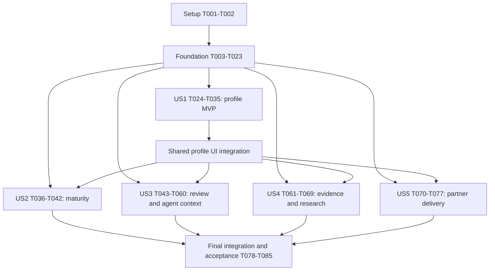

# Tasks: Customer profiles, maturity and context review

**Input**: [spec.md](spec.md), [plan.md](plan.md), [research.md](research.md),
[data-model.md](data-model.md), [contracts](contracts/profile-api.md), and
[quickstart.md](quickstart.md).
**Status**: Implementation in progress; completed tasks are checked, and remaining
acceptance and coverage work stays open.

**Tests**: Required by the spec's scripted access/state/rubric scenarios and the
constitution. Write the listed behavioral tests before their implementation and
verify they fail for the intended missing behavior, then pass after implementation.
Do not add implementation-mirroring tests or claim human walkthrough evidence from
an automated runner.

**Organization**: Five user-story phases in spec priority order, preceded by shared
setup/domain prerequisites. All paths are repository-relative. A task may introduce
a new named file; preserve existing code, migrations, configured model and credentials.

## Format and execution rules

Each checklist line has a sequential task ID, optional `[P]`, story label only in
story phases, a concrete outcome and exact file paths. `[P]` permits parallel work
only within the explicitly listed ready batch; it does not bypass phase dependencies.
Unmarked implementation tasks run in listed order. A story checkpoint requires its
tests passing; a fixture-based independent test does not mean an unbuilt dependency
can be skipped. Do not install integrations, reconnect Vercel, deploy, or implement
004+ capabilities. Use CLI WebKit for UI checks.

## Phase 1: Setup

**Purpose**: Confirm the installed framework seams and safe test inputs without
reinitializing the project or changing dependencies.

- [X] T001 Verify the planned dynamic-instruction, hook and typed-tool seams against `node_modules/eve/docs/README.md`, `node_modules/eve/docs/instructions.mdx`, `node_modules/eve/docs/guides/hooks.md`, and the routed Next.js guide; record installed versions, baseline limitations and the planned check matrix in `specs/003-customer-profile-review/validation.md`, preserving `agent/agent.ts` and `package-lock.json`.
- [X] T002 Create deterministic synthetic profile/source/candidate fixtures with two workspaces, two partner organizations, two workloads, own/other pending content and internal-operation sentinel text in `tests/fixtures/profiles.ts`; reuse the local disposable-database guard in `tests/fixtures/database.ts` and never copy old demo/customer data.

## Phase 2: Foundational prerequisites

**Purpose**: Establish the shared persistence, approval, projection and context
contracts before any story is exposed. Tests T003–T005 can be authored together after
Phase 1; remaining tasks are ordered. All manual record kinds share this foundation.

- [X] T003 [P] Add boundary tests in `tests/unit/profile-schemas.test.ts` for all eleven discriminated payloads, unknown-field rejection, server-owned identity/origin/state, exact bounds and invalid dates from `data-model.md`; include cross-kind enum confusion and partner attempts to set trusted origin. Cover canonical key cardinality, product-key normalization, NULL customer scope, strict qualityInput fields and persisted unknown defaults.
- [X] T004 [P] Add disposable migration/privilege tests in `tests/integration/profile-migrations.test.ts` for clean initialization, upgrade from 006 preserving customer/grant/chat IDs, wrong environment, partial migration, append-only content and inability of the runtime role to alter schema.
- [ ] T005 [P] Add state/authority concurrency tests in `tests/integration/profile-review-state.test.ts` for competing accept/reject, pending correction preserving accepted head, acceptance versus steward/grant/source withdrawal, retry/digest conflict, self-review attribution and separate initial-decision versus later-retraction events. Race creation/acceptance of the same canonical slot, proving one root/head, no hidden-candidate signal and no historical fallback after retraction.
- [X] T006 Define shared envelope, command and DTO schemas in `lib/contracts/profiles.ts`: quote and enforce “All timestamps are UTC instants”, “IDs are server-created UUIDs”, “No client or model selects workspace, author, accepted status or trusted origin”, “Payload schemas reject unknown fields”, “title 1–160 characters, narrative at most 8,000, rationale 1–2,000”, “at most 20 evidence references, payload at most 32 KiB; command body at most 64 KiB”, and “allow only `https` public source URLs without embedded credentials”. Define qualityInput and acknowledgeOlderObservation exactly as contracted; reject client-computed F/Q and normalize omitted inputs before digesting.
- [X] T007 Implement the strict eleven-kind payload union in `lib/contracts/profile-payloads.ts`, imported by `lib/contracts/profiles.ts`, using every required/optional field from the data-model table; preserve “optional business description, objectives, region and aliases”, “optional merge-target relation requiring steward review”, “optional synthetic contact detail”, “optional justified journey stage”, “optional dates”, “optional title”, and “optional private chat lineage”; source or relationship IDs must resolve within the authorized customer, never arbitrary object blobs.
- [X] T008 Add profile/evidence/review tables in `migrations/007-profile-context.cjs`, including sources/source events, checks, quality snapshots, conflicts, private lineage and audit; enforce “Composite foreign keys enforce matching workspace and customer”, “One accepted head per record”, “Payload/provenance immutable; unique record/revision”, “Unique revision: one initial review outcome”, “Unique customer/membership; active internal members only”, pinned evidence and no scope/kind mutation; preserve existing `customer_references` IDs and migration hashes. Add database uniqueness for the data-model canonical keys, treating NULL workload as one customer-wide scope; keep product keys immutable.
- [X] T009 Add conversation/attempt authority, audience generation and `context_snapshot_receipts` in `migrations/008-profile-context-fences.cjs`; persist “login session ID, membership, owner/customer/environment” and “as_of”, “valid_until”, schema version, snapshot digest, exact citation IDs and completeness/truncation; enforce “Do not store auth cookie tokens” and keep all receipts private server state.
- [X] T010 Update `migrations/manifest.json`, `scripts/db-role-setup.sql`, `lib/server/db/readiness.ts`, `app/api/health/ready/route.ts` and fixture initialization for 007/008; protect revisions/decisions/events/final receipts with insert/read-only privileges or invariants, keep pointers separately mutable, and fail closed before serving an incompatible schema.
- [X] T011 Implement shared transaction authority/locking in `lib/server/profiles/policy.ts` and adapt `lib/server/access/service.ts`, `lib/server/conversations/binding.ts` and affected callers to the data-model order: sorted memberships → principal/session/workspace/organization → customer state → grants/stewards → conversation/attempt → records/sources; recheck current authority, serialize missing steward rows through customer state, and use bounded lock/statement timeouts without network waits.
- [X] T012 Implement immutable command receipts in `lib/server/profiles/commands.ts`: “Unique workspace/actor/request key; different digest/action is 409; authorization rechecked before replay”; acquire the transaction-scoped actor/request lock after authority locks, atomically insert only the completed receipt with the mutation, and forbid committed unfinished reservations or receipt updates.
- [X] T013 Implement scoped records, immutable candidates and history storage in `lib/server/profiles/repository.ts` and `lib/server/profiles/revisions.ts`; use states “pending”, “accepted”, “rejected”, “superseded” and “retracted”; enforce “Candidate sequence numbers are internal-only”, preserve accepted heads during pending corrections, and return opaque candidate IDs to partners without hidden global counters. Resolve/create keyed roots under the customer guard without exposing hidden candidates; persist rating inputs/proposer in the immutable revision and digest.
- [X] T014 Implement deterministic `evidence-quality-v1` calculations in `lib/server/profiles/quality.ts` using “Q = round(25 × (0.40R + 0.30F + 0.20D + 0.10C))”, R/D/C ratings 0–4 and the published windows/bands; enforce “F is 4 through one window, 3 through 1.5, 2 through two, 1 beyond two, and 0 for unknown or invalid dates”, “An overdue explicit review caps F at 1 and labels Stale”, “missing date remains F=0”, and `validUntil` as the next future transition “capped at 24 hours after the snapshot”. Treat unknown information type/date basis as F=0/Unknown and never use retrieval/event dates as evidence age.
- [X] T015 Implement foundational audience/source projection in `lib/server/profiles/projection.ts`; quote and enforce “`internal` is the default candidate audience”, “`delivery` means needed for the assigned customer engagement”, categories “delivery context, internal operations, commercial, personnel or other internal content”, and “Contributors cannot declassify internal accepted data”; exclude incompatible operational data, private lineage, hidden source/counterpart metadata, counts and version increments before pagination.
- [X] T016 Implement source/evidence validation and audience-specific generation changes in `lib/server/profiles/eligibility.ts` and `lib/server/profiles/context.ts`; enforce “Same authorized customer; no cycles; source revisions are pinned, not silently upgraded”, current/visible support or explicit limitation, no hidden internal-only generation change for partners, and atomic dependent invalidation on acceptance/retraction/source withdrawal/confirmed conflict.
- [X] T017 Implement customer stewardship assignment/revocation in `lib/server/profiles/stewards.ts`; only current internal admins administer assignments, internal stewards review their customer only, partners never review, self-review stays attributed and optimistic assignment changes share the customer guard with acceptance.
- [X] T018 Implement exact-version acceptance/rejection in `lib/server/profiles/review.ts`; verify candidate ID/digest, `expectedRecordVersion` and `expectedAcceptedRevisionId` under the customer/source guard, validate sources/audience, atomically supersede/set the head and synchronize approved names, require rationale and safe partner reason, and preserve “Review rejection is terminal for that candidate”. Confirm the exact candidate qualityInput, require acknowledgment of an older maturity observation window, and reject rating edits under an existing digest.
- [X] T019 Implement contribution requests, steward/admin withdrawal and source lifecycle commands in `lib/server/profiles/retractions.ts`; enforce request states “open/resolved/declined”, “Request does not change eligibility; exact target must still be current when resolved”, source-only research withdrawal, immediate dependent ineligibility and “Withdrawing a source never revives a superseded profile revision”; reset retracted detail labels atomically to Unknown without changing identity/grants.
- [X] T020 Implement the shared command dispatcher and HTTP boundary in `lib/server/profiles/service.ts` and `app/api/customers/[customerId]/commands/route.ts`, plus receipt lookup in `app/api/customers/[customerId]/commands/[requestKey]/route.ts`; wire all implemented actions, strict CSRF/origin/session checks, 401/403/404/409/413/422/429/503 envelopes, no-store, 120 reads/30 writes per minute per membership/customer, and no client-selected accepted or research origin.
- [X] T021 Implement stable customer/workload anchors and approved name/merge behavior in `lib/server/profiles/identity.ts`, `app/api/customers/route.ts`, `scripts/create-demo-customer.ts` and `scripts/bootstrap-demo.ts`; preserve “only internal admins create new customer anchors”, “internal contributors may propose workloads”, “Do not grant partners new customer shells before identity acceptance”, neutral “Pending customer/workload” labels, “Merge target is same customer, no cycles”, historical scope and fixed synthetic-only baseline provenance without overwriting user revisions.
- [X] T022 Add append-only domain audit and content-free telemetry in `lib/server/profiles/audit.ts` and `lib/server/observability.ts`; record permitted IDs, operation/outcome/time/versions/duration while excluding payloads, source passages/URLs, private chat and credentials; expose only projected event/reason fields rather than the internal audit feed.
- [ ] T023 Add shared protected read/command contract tests in `tests/contracts/profile-foundation.test.ts` and fixed idempotent fixtures in `scripts/seed-profile-demo.ts`; verify pending manual fields, current reauthorization before receipts, forbidden trusted-origin input and hard audience exclusions, then run T003–T005/T023 and record foundation results in `specs/003-customer-profile-review/validation.md` before exposing story routes.

**Checkpoint**: Migrations, typed records, authority, review transitions and partner
filters pass. US1 can use explicit synthetic accepted fixtures; no manual edit or
new model tool is enabled without the foundation enforcing its gate.

## Phase 3: User Story 1 — Understand a customer in one profile (P1)

**Goal**: Rich current/historical profiles with customer/workload scope and explicit
unknowns. **Independent test**: Open two synthetic workloads, submit a product/risk
revision, accept through the tested domain service, and compare current/history;
verify a sparse profile and another workspace. Full review UI is not needed to test
this slice. **MVP**: Phase 1 + Phase 2 + US1, with basic partner filtering already active.

### Tests first

- [ ] T024 [P] [US1] Add profile/list/history/source DTO contract cases in `tests/contracts/profiles.test.ts` for internal-all workspace visibility, scope mismatch 404, sparse profiles, name sync, bounded cursors, search/count projection and no hidden partner revision counters. Verify singleton overview/directory agreement and list-kind multiplicity; source DTO cases here cover nested metadata only, with the standalone source endpoint verified in US4.
- [X] T025 [P] [US1] Add identity/workload/product/risk history integration cases in `tests/integration/profile-history.test.ts` including same-product different workloads, pending rename, approved merge without evidence rebinding, stable grants/chats and rollback on invalid relationship. Cover duplicate keyed proposals, current-head selection independent of observation timestamps, retraction to Unknown including directory/workload labels and merge retaining old keyed scopes.
- [X] T026 [P] [US1] Add profile read/propose/history WebKit scenarios in `tests/ui/profiles.spec.ts` for populated/sparse/loading/unavailable/denied states, keyboard focus, both themes and widths, and no fabricated saved success.

### Implementation

- [X] T027 [US1] Complete profile payload handling in `lib/server/profiles/profile-records.ts`: product “actual/evaluating/planned/retired/unknown state” with usage/scope/observed/owner; risk “likelihood 1–5, impact 1–5, severity low/medium/high/critical with rationale” and “open/mitigating/resolved/accepted status”; engagement “past/current/future timing” with independent phase and “no time entries, allocation or execution controls”; preserve stakeholder responsibilities, decision owner/effective date/evidence, outcome “measure/unit/period if quantified” and “unknown baseline remains explicit”, and next-review subject/owner/due/action without inventing completion facts.
- [X] T028 [US1] Implement current profile aggregation and scoped reads in `lib/server/profiles/read.ts` using “stable `(created_at,id)` keyset pagination and scoped `ILIKE` text search”, default 25/max 50 records, query ≤200 characters, projected counts and workload selection; return distinct `acceptedFacts`, `attributedResearch` and `ownSubmissions` with actual empty/unavailable distinctions. Read canonical accepted pointers using the data-model cardinality table; never select current by observation timestamp or resurrect historical heads.
- [X] T029 [US1] Add GET handlers in `app/api/customers/[customerId]/profile/route.ts`, `app/api/customers/[customerId]/records/route.ts`, `app/api/customers/[customerId]/records/[recordId]/route.ts` and `app/api/customers/[customerId]/records/[recordId]/history/route.ts`; bind cursors to authorized scope/filter/audience and use only shared projections.
- [X] T030 [US1] Upgrade directory selection/name search/profile links in `app/(workspace)/customers/page.tsx`, `app/_components/customer-picker.tsx` and `lib/server/access/customers.ts`; preserve existing safe directory keys and Start chat behavior, all internal workspace customers and current partner grants.
- [X] T031 [US1] Build the accepted overview/workload sections in `app/(workspace)/customers/[customerId]/page.tsx` and `app/_components/profiles/profile-overview.tsx` with synthetic marker, separate maturity/engagement displays, eleven-kind presentation and contextual navigation; never fetch raw server rows into client props.
- [X] T032 [US1] Build shared typed proposal/correction forms in `app/_components/profiles/record-form.tsx` with requested audience, evidence links, accepted-versus-proposed comparison, Pending receipts and retained request keys on uncertain failure; edits never replace the visible accepted head before approval. Add proposed qualityInput controls/default labels using the strict shared schema; keyed kinds propose revisions to their canonical root.
- [X] T033 [US1] Build projected revision/event history in `app/_components/profiles/record-history.tsx`, displaying scope, source, author, observed/effective dates and review state while keeping hidden provenance/partner history absent from markup and payloads.
- [X] T034 [US1] Apply reference cards/table layouts, responsive sections, focus/contrast and reduced-motion states in `app/_components/profiles/profile-states.tsx` and `app/globals.css`; preserve existing shell tokens and make Unknown distinct from a negative assessment.
- [ ] T035 [US1] Run T024–T026 plus relevant foundation regressions through existing test scripts and record independent US1 outcomes and synthetic visual evidence paths in `specs/003-customer-profile-review/validation.md`; do not claim human SC-001 evidence yet.

## Phase 4: User Story 2 — Assess a scoped maturity journey (P1)

**Goal**: Evidence-backed dimensions and a separate journey stage with revision
history. **Independent test**: Seed two supported dimensions, leave others Unknown,
submit/review a later assessment through the domain service and verify stage and
engagement phase never advance each other. Use the US1 page containers for UI.

### Tests first

- [X] T036 [P] [US2] Add maturity schema/rubric and WebKit journey tests in `tests/unit/profile-maturity.test.ts` and `tests/ui/profile-maturity.spec.ts` for independent dimensions, observation/review dates, required support, Unknown rationale and no average/product-count or engagement-phase inference.
- [X] T037 [P] [US2] Add assessment HTTP/domain acceptance and historical-version cases in `tests/contracts/profile-maturity.test.ts`, including source withdrawal, pending-versus-accepted assessment and cross-workload evidence misuse. Verify older-window replacement requires explicit acknowledgment and retraction does not select a prior assessment.

### Implementation

- [X] T038 [US2] Define `customer-maturity-v1` in `lib/server/profiles/maturity.ts` and `docs/maturity-rubric.md`, adapting only legacy stage/dimension evidence principles; preserve “Explore, Activate, Accelerate, Optimize, Scale, Transform”, keys “outcome_ownership, delivery_collaboration, experience_adoption, operational_trust, platform_organization and innovation_ai”, and “Unknown/Emerging/Established/Measured/Scaled/Adaptive”; no unrelated product prescriptions.
- [X] T039 [US2] Integrate assessment validation with `lib/contracts/profile-payloads.ts` and `lib/server/profiles/review.ts`: require scope/window/assessor/rubric/rationale/evidence/next capability/review date; quote “Unknown requires a missing-evidence explanation rather than a fabricated citation”, “Non-Unknown assessments require eligible support”, “Observation start must not exceed end”, “review date must follow the observation window” and “A future review is valid; a future observation is invalid”. Enforce one maturity root per scope and explicit acknowledgment when accepting an older observation end.
- [X] T040 [US2] Build dimension/stage assessment and history components in `app/_components/profiles/maturity-assessment.tsx` and integrate them into `app/_components/profiles/profile-overview.tsx` and `app/_components/profiles/record-form.tsx`; label unsupported historical assessments and preserve Pending status until steward review.
- [X] T041 [US2] Run and resolve failures in the previously authored WebKit assessment/edit/history scenarios in `tests/ui/profile-maturity.spec.ts`, including all six independent states, scope/time/rubric citations, sparse evidence and separation from engagement phase.
- [X] T042 [US2] Run T036–T037/T041 with foundation source/approval regressions and record the independent maturity proof in `specs/003-customer-profile-review/validation.md` against FR-004–006 and SC-004.

## Phase 5: User Story 3 — Review submitted customer context (P1)

**Goal**: Exact-version human review plus governed chat read/propose behavior.
**Independent test**: Submit from a profile and owned chat, accept/reject/correct/
request-retract/retract as authorized, then verify profile and actual eve context;
repeat stale/retried decisions and invalidate an active or compacted conversation.

### Tests first

- [ ] T043 [P] [US3] Add review/submission/steward/receipt HTTP contracts and WebKit journey tests in `tests/contracts/profile-review.test.ts` and `tests/ui/profile-review.spec.ts` for assignment authority, own pending/rejected visibility, safe reasons, exact version/digest, all command actions and typed errors. Test rating confirmation, correction as a new Pending revision, and attempted in-place/client-score overrides.
- [ ] T044 [P] [US3] Add eve tool/instruction/hook contracts in `tests/contracts/profile-agent-context.test.ts` for bound actor/customer, source-span verification, pending-only proposal, original message digest preservation, failed/missing initial injection and mandatory validation before each model step.
- [ ] T045 [P] [US3] Add context-fence integration tests in `tests/integration/profile-context-fences.test.ts` for retraction/visibility change during release, grant/session expiry, native reconnect/replay, compaction, stale snippets, time-only expiry, empty/already-stale snapshots, and no imported history in a fresh conversation. Explicitly cover US3 scenarios 6–7: time-only expiry/24-hour cap, relevant changes, hidden internal changes, unbound 002 history and fresh-session recovery.

### Implementation

- [X] T046 [US3] Implement customer review, own submissions and stewardship GET handlers in `app/api/customers/[customerId]/review/route.ts`, `app/api/customers/[customerId]/submissions/route.ts` and `app/api/customers/[customerId]/stewards/route.ts`; enforce steward-only queue, internal-only assignment view and no other contributor's unaccepted partner metadata.
- [X] T047 [US3] Build exact candidate review/retraction UI in `app/(workspace)/customers/[customerId]/review/page.tsx` and `app/_components/profiles/review-queue.tsx`, showing diff/source/quality/audience/history and separate private/partner-safe reasons; changed payload/audience produces a new candidate, 409 preserves unsaved input, and contributor requests cannot execute withdrawal. Show proposed/confirmed rating inputs, rationales and date basis; changed ratings create a new candidate before review.
- [X] T048 [US3] Build stewardship and own-submission/status controls in `app/_components/profiles/steward-editor.tsx` and `app/_components/profiles/own-submissions.tsx`; show self-review attribution, no bulk acceptance, revocation-aware actions and no hidden review details.
- [X] T049 [US3] Implement explicit owned-message claim submission in `lib/server/profiles/chat-claims.ts`, `app/_components/profiles/share-chat-claim.tsx` and `app/_components/agent-chat.tsx`; preview exact selected/edited text and customer, validate owner/message/span/digest and persist private lineage without sharing the surrounding conversation.
- [X] T050 [US3] Bind server-owned authority/generation/deadline to attempts in `lib/server/conversations/dispatch.ts`, `lib/server/conversations/binding.ts` and `agent/channels/eve.ts`; resolve actual session/membership/customer on execution, preserve existing input digests and uncertain-run reconciliation, and treat unbound 002 conversations as historical.
- [X] T051 [US3] Complete bounded context snapshots/receipts in `lib/server/profiles/context.ts`: fixed actor/customer, at most 20 records and 24 KiB, explicit partial/unknown support, exact citations, separate accepted/research labels and next future `validUntil` capped at 24h; no pending or withdrawn facts and no past deadline loop for already-stale context.
- [X] T052 [US3] Add `agent/instructions/customer-context.ts` using documented dynamic user-role injection at `turn.started` and `agent/hooks/guard-customer-context.ts` for every `step.started`; validate snapshot receipt/authority/generation/deadline, fail closed on missing/failed injection, and keep original native user text and root `agent/instructions.md` intact.
- [X] T053 [US3] Add `agent/tools/customer_context.ts` and `agent/tools/propose_customer_context.ts` backed by shared domain services; restrict read input to kind/current workload/query/page, writes to Pending proposals, stable attempt/tool-call/source-span digest receipts, and no actor/customer/trusted-origin/approval/retraction inputs; generated assessments remain labeled proposals rather than fabricated user quotations. Accept tentative qualityInput only through the shared proposal schema; omitted inputs retain unknown defaults and no tool can confirm ratings.
- [X] T054 [US3] Enforce context/authority checks in `lib/server/conversations/eve-routes.ts`, `lib/server/conversations/stream.ts` and `lib/server/conversations/projection.ts` before native reads/replays and every release batch; serialize short release authorization with mutations, do not retain the prior 10-second check interval as this guarantee, do not wait for backpressure under a DB lock, and cancel/fence without redispatch.
- [X] T055 [US3] Add stale-history DTO behavior in `lib/server/conversations/repository.ts`, `lib/contracts/conversations.ts` and `app/_components/agent-chat.tsx`; retain owner messages under current grants but withhold stale generated/tool bodies and snippets, show context-changed status and an explicit fresh same-customer conversation action; never rebind/reset native sessions or import old summaries. Verify US3 scenarios 6–7 in both app/native reads, including generated titles/snippets, retained owner messages, no copied summary and current-access denial.
- [X] T056 [US3] Update `agent/instructions.md` and capability tests in `tests/unit/agent-capabilities.test.ts` for actual read/propose/citation limits, untrusted source text, distinct review/research states and no inferred private facts; keep all unused web/file/host/delegation capabilities disabled and preserve `agent/agent.ts` model selection.
- [X] T057 [US3] Add behavior datasets and runner support in `evals/fixtures/003-context-governance.json`, `scripts/eval-behavior-local.ts` and `scripts/verify-behavior-review.ts`; preserve 002 cases and add `--feature 003`, six cases twice, a 14-model-turn cap, 120s per turn, explicit live flag, actual-output review and hard gates for source fidelity/approval/access.
- [ ] T058 [US3] Run and resolve failures in the previously authored WebKit review/chat-share/retraction/fresh-conversation scenarios in `tests/ui/profile-review.spec.ts`, covering save uncertainty, conflicting reviews, safe reasons, keyboard focus and clear historical status.
- [ ] T059 [US3] Run T043–T045/T058 and existing 002 ownership/dispatch/reconciliation regressions; prove no model step on missing injection and no stale native replay after compaction, recording actual outcomes in `specs/003-customer-profile-review/validation.md`.
- [X] T060 [US3] Run deterministic evaluation-dataset checks and the bounded opt-in synthetic 003 live evaluation through the configured local runtime, recording actual outputs, hard-gate rationale, timing/usage and any unavailable evidence in `specs/003-customer-profile-review/validation.md`; never substitute prompt assertions for live behavior or mark an unrun evaluation complete.

## Phase 6: User Story 4 — Judge research and evidence quality (P2)

**Goal**: Attributed, checked research and explainable current/historical quality.
**Independent test**: Ingest a fixed public snapshot through the trusted fixture path,
compare with a manual URL, withdraw a source and advance the clock through every
quality boundary; inspect labels and conflict effects without a discovery tool.

### Tests first

- [X] T061 [P] [US4] Add exhaustive quality boundary tests in `tests/unit/profile-quality.test.ts`, `tests/unit/profile-schemas.test.ts`, `tests/integration/profile-review-state.test.ts` and `tests/integration/profile-research.test.ts`: 0–4 inputs, 80/60/40 bands, 7/14/30/90/180-day windows, 1/1.5/2-window freshness, overdue cap, unknown/future evidence dates, separate future events, and exactly future bounded validity deadlines. Test persisted unknown rating defaults, input authority/digest binding, information-type/date-basis validation and historical input traceability.
- [X] T062 [P] [US4] Add source/research contracts and WebKit journey tests in `tests/contracts/profile-evidence.test.ts` and `tests/ui/profile-evidence.spec.ts` for source-specific visibility, public passages/check bundles, user-origin laundering denial, exact source revision, private-lineage exclusion and withdrawal of research with no profile record.
- [X] T063 [P] [US4] Add source dependency/conflict races in `tests/integration/profile-evidence.test.ts` and `tests/integration/profile-research.test.ts`, proving source withdrawal/confirmed conflict cannot race acceptance into eligible guidance, copied sources are not independent corroboration, and hidden conflict endpoints do not leak.

### Implementation

- [X] T064 [US4] Implement trusted source ingestion in `lib/server/profiles/research.ts` and extend `scripts/seed-profile-demo.ts`; require location/title/retained passage/digest, rights/audience, publication/observation/event/retrieval dates and checked actor/scope/integrity/content, enforcing “Origin is server-assigned and immutable”, “All required checks pass before `researched` eligibility” and “no client/model origin selection”; manual corrections stay Pending and no discovery/fetch endpoint is added. Require the shared qualityInput envelope and captured ingest actor/time; re-ingestion creates a new immutable source revision without upgrading pinned dependents.
- [X] T065 [US4] Implement historical quality persistence and current source projection in `lib/server/profiles/evidence.ts` using the foundational calculator; enforce “Append-only historical snapshot; current quality recomputed with clock, not assumed from latest stored Q”, retain R/D/C rationale/date basis/asOf, and separate attributed research from accepted facts even at high scores. Reference immutable rating input revision/proposer and acceptance or ingest identity in snapshots; clock recomputation cannot alter R/D/C. Manual research-rating corrections remain new Pending claims.
- [X] T066 [US4] Implement flag/confirm/resolve conflict commands in `lib/server/profiles/conflicts.ts` and wire `lib/server/profiles/service.ts`; store exact revision pairs and steward/admin resolution, distinguish an unverified concern from a confirmed material conflict with “open/resolved state via events”, preserve “No hidden counterpart metadata in partner projection”, and re-evaluate dependencies/generations without rewriting approved assessments.
- [X] T067 [US4] Add source GET handling in `app/api/customers/[customerId]/sources/[sourceRevisionId]/route.ts` and evidence/quality/conflict UI in `app/_components/profiles/evidence-detail.tsx`; show direct support, attributed Research, dates, components/version, safe restricted-source attestations, stale/unknown/conflicted labels and authorized source withdrawal actions.
- [ ] T068 [US4] Run and resolve failures in the previously authored research/quality/history WebKit scenarios in `tests/ui/profile-evidence.spec.ts` and T061–T063; test trusted fixture versus manual URL, no unsupported private facts and usable source unavailable/restricted states. Verify end-to-end proposed ratings → exact approval → pending correction → approved replacement, plus trusted fixture ingestion and projected support without private rationale leakage.
- [X] T069 [US4] Integrate trusted research/source changes into `lib/server/profiles/context.ts` and the 003 behavior dataset, then record the independent source/quality/withdrawal evidence in `specs/003-customer-profile-review/validation.md` without enabling 005 retrieval/discovery.

## Phase 7: User Story 5 — Deliver within a partner boundary (P2)

**Goal**: End-to-end proof of customer-specific delivery access, all contributors'
accepted delivery facts, and own-only unaccepted submissions. Basic filtering is
already required in Phase 2; this phase completes partner UX and full regression.
**Independent test**: Use two customers/workspaces/partner organizations, grant one
customer, exercise every read/write/history/tool path, then revoke mid-session.

### Tests first

- [X] T070 [P] [US5] Add partner projection unit cases in `tests/unit/profile-partner-projection.test.ts` for every payload/data category, restricted sources/attestations, own pending/rejected safe reasons, internal-only fields and invisible candidate sequence/version changes.
- [ ] T071 [P] [US5] Add partner HTTP/tool denial and WebKit journey tests in `tests/contracts/profile-partner.test.ts` and `tests/ui/profile-partner.spec.ts` for ungranted IDs, search/snippets/counts/cursors/history/receipts, other-contributor unaccepted rows, operational data, internal notes and private chat; all accepted delivery contributors remain visible.
- [ ] T072 [P] [US5] Add partner revocation/concurrent-read integration cases in `tests/integration/profile-partner-access.test.ts` for membership/org/grant loss after dispatch, hidden-write delivery-generation stability, visible-support withdrawal and safe stale native/application history.

### Implementation

- [X] T073 [US5] Complete exact partner DTO/schema handling in `lib/server/profiles/projection.ts` and `lib/contracts/profiles.ts`; test every nested field and dependent source against T070–T072, permit only current delivery accepted/researched records and own pending/rejected content, and exclude hidden author/decision/source details and global candidate counters.
- [X] T074 [US5] Finish partner-safe history, filter and receipt projections in `lib/server/profiles/read.ts`, `lib/server/profiles/commands.ts` and `lib/server/profiles/context.ts`; enforce permissions before every count/limit/query and current authorization before receipt replay, with generic 404s and no partner signal for unrelated internal changes.
- [X] T075 [US5] Complete partner-specific profile/submission/navigation controls in `app/_components/profiles/profile-overview.tsx`, `app/_components/profiles/own-submissions.tsx` and `app/_components/app-shell.tsx`; display accepted delivery context from any contributor, own status/reasons and no inaccessible queue/operations controls or hidden counters.
- [ ] T076 [US5] Run and resolve failures in the previously authored full partner delivery/revocation WebKit flow in `tests/ui/profile-partner.spec.ts` in all four projects, exercising accepted facts from different contributors, own-only unaccepted submissions, direct URL tampering and protected-content clearing after loss of access.
- [ ] T077 [US5] Run T070–T072/T076 plus existing cross-owner conversation tests and record the complete access matrix and independent US5 outcome in `specs/003-customer-profile-review/validation.md`; no private real-customer data or invented shared-learning availability.

## Phase 8: Polish and cross-cutting acceptance

**Purpose**: Complete runnable acceptance evidence, recovery and documentation after
all five stories pass. These tasks do not authorize Vercel reconnect/deployment.

- [X] T078 Add the disposable profile benchmark in `scripts/benchmark-profiles.ts` using 100 synthetic profiles ×25 records, 10 sessions (4 panel/4 admin/2 partner), 30s warmup/120s measurement and one open per session/second; measure visible view readiness p50/p95/errors/authorized counts with projections enabled, require p95 <2s and zero incorrect rows, and record environment/results in `specs/003-customer-profile-review/validation.md`.
- [X] T079 Run the four CLI WebKit projects with axe and synthetic screenshots for all changed views, fixing actual keyboard/focus/contrast/overflow/state failures in `app/_components/profiles/profile-states.tsx` and `app/globals.css`; record 390×844/1440×900 light/dark outcomes and zero serious/critical axe findings in `specs/003-customer-profile-review/validation.md`.
- [X] T080 Extend and run migration/backup recovery checks in `tests/integration/profile-migrations.test.ts`, `scripts/profile-upgrade-check.ts` and `scripts/restore-demo-check.ts`; prove clean init/006 upgrade preserve grants/chats, append-only protections survive grants, failed migration stays unready and disposable restore/reapply works; update recovery steps in `specs/003-customer-profile-review/quickstart.md`.
- [ ] T081 Run `check:docs`, typecheck, unit/integration/contracts, both build targets and final 003 live behavior review after all stories are integrated; preserve existing 002 regressions and record actual commands/results, failures and remaining evidence in `specs/003-customer-profile-review/validation.md`; validate real usage against the explicit 14-turn evaluation cap.
- [ ] T082 Prepare and conduct the five-person synthetic walkthrough specified in `specs/003-customer-profile-review/quickstart.md`, recording anonymized timings/results in `specs/003-customer-profile-review/usability.md`: SC-001 three-minute discovery and SC-006 two-minute review/state recognition both need 5/5 for a five-person 90% target; keep this task unchecked if actual participants/results are unavailable while completing independent engineering work.
- [X] T083 Update implemented behavior, setup/limitations, actual command availability and validation links in `README.md`, `ROADMAP.md`, `specs/003-customer-profile-review/plan.md` and `specs/003-customer-profile-review/quickstart.md`; distinguish local/CI/human acceptance from merge/hosted readiness and keep private credentials and authorship attribution out of artifacts.
- [ ] T084 Review final FR-001–020/SC-001–007 coverage, task completion evidence, source/date/permission behavior and scope against `specs/003-customer-profile-review/spec.md`; record any unmet acceptance criteria honestly in `specs/003-customer-profile-review/validation.md` and resolve implementation gaps before claiming the feature complete.
- [ ] T085 Prepare the feature PR using `.github/pull_request_template.md` with spec/validation links, resulting behavior, migration/recovery and README impact; record the PR URL in `specs/003-customer-profile-review/validation.md`, obtain required review and leave merge/release status truthful in `ROADMAP.md`; do not claim merge or trigger deployment as part of task generation.

## Dependencies and execution order

All story phases depend on T001–T023. The foundation intentionally owns review and
partner enforcement because profile writes/reads cannot safely defer them to later
UI stories. T024–T026 can be authored together; subsequent US1 implementation is
sequential. Later story test batches can start after the foundation using fixtures.
US2/US3/US4/US5 UI integration reuses US1 containers; standalone services/contracts
remain independently testable. Final integration gates are T035, T042, T059–T060,
T068–T069 and T077. T078–T085 follow all technical story gates.

Shared modules (`service.ts`, `review.ts`, `context.ts`, schemas and overview) must
be edited serially even when independent test files are authored in parallel.
T050–T056 must all pass before enabling the new agent capabilities; a read tool
without history/invalidation protection is not an acceptable intermediate release.
US4's source/quality additions must rerun US3 fences and US5 projection tests.
T082 may wait on actual human participation; it does not block other independent
technical tasks or justify claiming its acceptance criterion passed. T085 may open
an honest draft with remaining evidence recorded; merge readiness requires the
project's review and acceptance policy and an explicit user merge instruction.

## Parallel execution examples

Each row is a ready batch after its prerequisites, with disjoint output files.
Parallel markers apply to authoring the tests; execute them against implementation
when the relevant services exist. No parallel marker authorizes same-file edits.

| Story | Ready after | Parallel tasks | Independent proof |
| --- | --- | --- | --- |
| US1 | T023 | T024 contracts, T025 persistence, T026 UI | Two workloads, sparse profile, pending edit/current history |
| US2 | T023; US1 for UI | T036 rubric, T037 assessment contract | Independent dimensions, exact supported revision, separate phase |
| US3 | T023; US1 for UI | T043 review, T044 tools/hooks, T045 stale-context integration | Submit→review→retract across profile/chat, current guidance only |
| US4 | T023; US1 for UI | T061 scoring, T062 source contract, T063 source race | Trusted research versus manual URL, time boundaries and withdrawal |
| US5 | T023; US1 for UI | T070 payload projection, T071 transport denial, T072 revocation | All accepted delivery contributors, own pending only, no leaks |

For example, T043/T044/T045 can be authored concurrently because they use separate
test files and the completed shared contracts. T052/T053/T054 are sequential because
the snapshot/authority seam must exist before tools and runtime release protection.

## Requirements coverage

| Requirement group | Primary task coverage |
| --- | --- |
| FR-001–003 identity/profile/product use | T006–T013, T021, T024–T035 |
| FR-004–006 maturity/engagement distinction | T007, T027, T036–T042 |
| FR-007 risks | T007, T015, T025, T027, T032 |
| FR-008–011 manual review/retraction | T005–T019, T020, T032, T043–T049, T058–T060 |
| FR-012–015 research/quality/history/conflicts | T008, T014–T019, T061–T069 |
| FR-016–018 authority/partner/current context | T009–T020, T043–T060, T070–T077 |
| FR-019 accessible UI | T026, T030–T034, T040–T041, T047–T049, T055, T058, T067–T068, T075–T076, T079 |
| FR-020 synthetic/local scope | T001–T002, T021–T023, T064, T078–T085 |
| SC-001/006 human usability | T082; T084 reports actual evidence |
| SC-002/003 isolation/lifecycle | T005, T023–T025, T043–T045, T058–T060, T062–T063, T070–T077 |
| SC-004/005 maturity/quality | T036–T042, T061–T069 |
| SC-007 performance/responsive UI | T078–T079 |

## Implementation strategy

1. Complete setup and the shared foundation, including real concurrency and denial
   checks. Preserve existing 002 behavior except the explicitly planned history
   transition when profile-aware guidance is enabled.
2. Deliver US1 as the smallest useful local MVP: current/historical profiles with
   controlled proposals, basic partner filtering and synthetic accepted fixtures.
   Use tested domain commands for its independent review verification.
3. Add the other stories in listed priority order, validating each checkpoint.
   Parallelize only the explicit test batches or disjoint files after prerequisites.
   Keep the agent tool/instruction/hook/fence integration atomic from a release view.
4. Complete performance, UI, recovery, live behavior and actual human evidence;
   update documentation and create a reviewable PR. Track any unavailable acceptance
   evidence as incomplete rather than inventing results or blocking unrelated work.

No implementation task is checked by generating this document. A future successful
merge leaves the PR closed and deletes its associated local/remote branch under
`CONTRIBUTING.md`; deployment remains a separate, deferred action.
